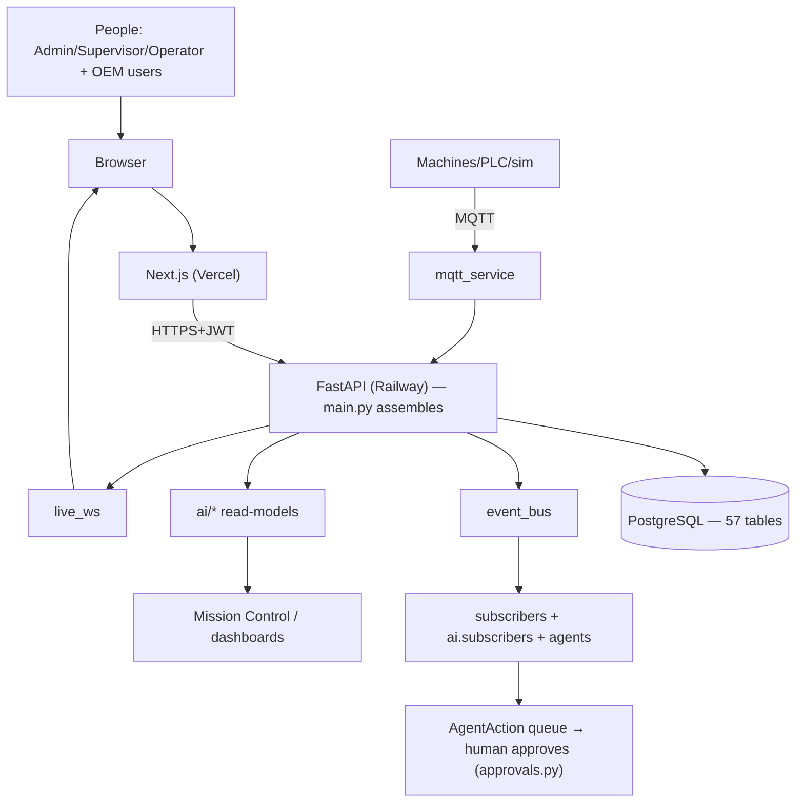

# AMP — Architecture Cheatsheet

*One-page refresher. Source of truth: commit `0eb94ca` (`master`). Full detail: AMP-FOUNDER-TECHNICAL-HANDBOOK.md.*

## What AMP is
An **AI operating system for manufacturing** (started as the FlowMES MES). Multi-tenant SaaS: many factories on one platform, each isolated. The MES is app #1; the platform (events, tenancy, AI, OEM) is the product.

## The stack
| Layer | Tech | Host |
|---|---|---|
| Frontend | Next.js 16 / React 19 / Tailwind 4 | Vercel → `app.marx8.com` |
| Backend | FastAPI + SQLAlchemy (single worker) | Railway (`flowmes-production.up.railway.app`) |
| Database | PostgreSQL 18, Alembic migrations | Railway |
| Real-time in | MQTT (paho-mqtt) | broker |
| Real-time out | WebSocket (FastAPI native) | Railway |
| AI | ~45 `ai/*` modules (rules) + 1 optional LLM | in-process |

## The system, one diagram

## Request lifecycle (every call)
`request+JWT` → **TenantScope** MW (bind tenant) → **SchemaGuard** (503 if schema wrong) → **RateLimit** → **CORS** → **SecurityHeaders** → **PlanGate** (403 if unlicensed) → route in `*_routes.py` → `Depends`(db, user, role) → ORM (auto tenant-filter) → Pydantic schema → JSON.

## Backend layers
1. **Foundation:** `database.py`, `models.py` (57 tables), `schemas.py`, `auth.py`, `security.py`
2. **Assembler:** `main.py` (27 `include_router`, middleware, `/ws/live`, sim loop)
3. **Domain apps:** 17 `*_routes.py` + OEM routes
4. **Backbone:** `events.py`/`subscribers.py`, `tenancy.py`, `ai/`, `approvals.py`, `analytics_engine.py`/`oee_contract.py`, `mqtt_service.py`/`mqtt_identity.py`, `live_ws.py`/`ws_auth.py`, `schema_guard.py`/`migrate.py`/`alembic/`
5. **Tests:** 193 `test_*.py` + 12 `mutate_*.py` + 8 `audit_*.py`

## Multi-tenancy (the safety property)
- `tenant_code` on ~every row; **37 models** auto-scoped (`SCOPED_MODELS`).
- Per request: pure-ASGI middleware decodes JWT once → `set_current_tenant()` (contextvar).
- **`do_orm_execute`** hook adds `WHERE tenant_code=?` to every SELECT; **`before_flush`** stamps new rows.
- Fail-closed: founder `X-Tenant` preview only for DEFAULT+Admin; NULL tenant hides; OEM binds sentinel `OEM:<code>`.

## Events (the nervous system)
Synchronous, in-process, shared DB session, appended to `EventLog`, broker-ready.
| Event | Producer | Key subscribers |
|---|---|---|
| ProductionCompleted | work_orders_routes | BOM move, AI rec, Maintenance/Yield agents |
| DowntimeStarted | machines_routes | AI rec, Maintenance/Escalation agents |
| InventoryLow | inventory_routes (+ BOM subscriber) | AI rec, Reorder agent |
| QualityInspectionFailed | quality_routes | AI rec, Quality agent |

## AI honesty (say this exactly)
- **Rules:** ~95% — deterministic thresholds + SQL (`predictive_engine`, all `ai/*` read-models).
- **LLM:** one feature (`ai_copilot.py`), **off without an API key**, always has a rules fallback.
- **Trained ML:** **none.**
- **5 agents** (Maintenance, Quality, Reorder, Escalation, Yield) *propose*; humans approve via `approvals.py`. Only Reorder auto-approves → a *Draft* PO.

## Real-time
- **MQTT:** topic `flowmes/{tenant}/{site}/machines`; identity = **(tenant, site, name)**; tenant from topic, never payload (ADR-0011).
- **WebSocket:** `/ws/live?token=`; authenticates **before accept** (ADR-0016); broadcasts only to the owning tenant.
- **Adapters:** MQTT/HTTP/WS real; **all direct PLC protocols simulated** (no driver installed).

## OEM platform
- Separate identity (`OemUser`); binds sentinel `OEM:<code>` → factory tables return 0 rows.
- **Factory-controlled claim** (ADR-0019): OEM offers a one-time hashed expiring code; only a factory Admin accepts (atomic conditional UPDATE sets `factory_tenant_code`).
- **Consent** (ADR-0017): 7 `SHARE_*` grants, default-deny, **allowlist** (copy-in), read fresh per request.
- **Service:** `operating_hours − last_service_hours` vs interval (never `% interval`).

## Ops / deploy (ADR-0018)
`push → CI (5 jobs) → merge → migrate.py → /readiness gate → Railway+Vercel`. `/health`=liveness, `/readiness`=schema-correct. Daily backup **with restore drill**. Single worker (holds live state). `SECRET_KEY` fail-closed in prod.

## The 19 ADRs (the decision spine)
0001 event bus · 0002 tenant scope · 0003 AI-as-consumer · 0004 agents act · 0005 agent oversight · 0006 machine-health twin · 0007 read-models · 0008 tenant lifecycle · 0009 modularize main · 0010 OEE money · 0011 machine identity · 0012 doc numbers · 0013 per-tenant BOM · 0014 canonical OEE · 0015 approval gate · 0016 authenticated WS · 0017 OEM fleet · 0018 migrations-before-serve · 0019 factory-controlled claim.

## To change AMP
Mostly **add**: a `*_routes.py`, a subscriber, a read-model, a `*Section.tsx` + 3 registrations (`include_router`, `event_bus.subscribe`, `modules.json`+`renderSection`). See AMP-CODE-CHANGE-GUIDE.md.
