# AMP — Founder Technical Handbook

> **The complete, plain-English course on the AMP platform — taught from the actual current codebase.**
>
> - **Source of truth:** commit `0eb94ca` on `master` (585 commits; born 2026-06-04 as *FlowMES-Enterprise*, today *AMP*).
> - **Written:** 2026-08-25. This is **teaching material only** — it changes no application code.
> - **Author's promise:** every file path, route, model, event, agent and role in this handbook was read in the real repository at the SHA above. Anything that could not be confirmed is marked **`UNVERIFIED`**.

## How to use this handbook

This is one of **six** documents under `docs/training/`. Read them in this order of need:

| Document | What it's for |
|---|---|
| **AMP-FOUNDER-TECHNICAL-HANDBOOK.md** (this file) | The full course, Chapters 1–31. Read start to finish once. |
| **AMP-ARCHITECTURE-CHEATSHEET.md** | One-page refresher on the big pieces. Re-read before a technical meeting. |
| **AMP-MODULE-MAP.md** | "Where does *X* live?" — a lookup table per module. |
| **AMP-DATA-FLOWS.md** | Step-by-step traces (login, MQTT, work order, OEM claim…). |
| **AMP-CODE-CHANGE-GUIDE.md** | "I want to change *X* — which files?" |
| **AMP-VIDEO-COURSE-SCRIPT.md** | A narration + screen-recording script to turn this into video. |

**Conventions used throughout**
- **Code locations** are written as `repo/relative/path.py:line` — clickable, and accurate to SHA `0eb94ca`.
- Each chapter follows the same rhythm: **What you'll understand → Simple explanation → How AMP implements it → Code locations → Step-by-step → Example → Diagram → Common confusion → If you want to change this → Quick recap.**
- Every technical term is explained the first time it appears. If you already know it, skim.
- **`UNVERIFIED`** flags anything I could not confirm in code at this SHA.

## Table of contents

**Part I — The big picture**
1. What is AMP?
2. How AMP was built (the real evolution)
3. Repository tour
4. How AMP starts (boot sequence)

**Part II — The spine**
5. Follow a login from click to database
6. The database
7. The backend (FastAPI)

**Part III — The factory**
8. Every factory module
9. Inventory deep dive
10. Production + Work Order + BOM

**Part IV — The nervous system**
11. The event bus
12. Read models
13. AI + agents
14. Digital Twin / Machine Health

**Part V — Real-time & isolation**
15. MQTT and machine data
16. WebSockets
17. Multi-tenancy
18. RBAC + security

**Part VI — The OEM platform**
19. OEM platform
20. Machine claim
21. OEM consent
22. Commissioning, warranty & service

**Part VII — Building & shipping**
23. Frontend
24. Testing
25. Git, PR, CI/CD
26. Production / Railway
27. What runs where?

**Part VIII — Working on AMP**
28. How do I change AMP?
29. Module code map
30. Data-flow cheat sheets
31. Current reality (what AMP really does today)

**Handbook finishers**
- If you only remember 20 things about AMP
- AMP in 5 minutes
- AMP in 30 minutes
- Test your understanding (25 questions)
- Where do I change this? (quick index)
- Appendix: Observations — not actioned

---

# Chapter 1 — What is AMP?

### What you will understand
By the end of this chapter you can say, in one breath, *what AMP is, what problem it kills, who uses it, and how the big pieces fit together.* Everything else in the handbook is a zoom-in on this picture.

### Simple explanation

**Start with the pain.** A factory turns cheap inputs (steel, boards, bearings) into valuable outputs (shafts, instrument clusters). The owner has exactly one obsessive question, every minute of every shift:

> *"Am I making enough good product, fast enough, without wasting money — and if not, **why, right now**?"*

Before software, that question was answered with clipboards, whiteboards, and people's memory. That works for 5 machines and **shatters** at 50, because a human's attention is a fixed size while the factory's flood of information grows with every machine. The gap between *what is actually happening on the floor* and *what the humans know is happening* is exactly where money leaks out.

**An MES closes that gap.** *MES = Manufacturing Execution System* — the software layer that sits between the business plan (orders, targets) and the physical machines, and tracks what is *actually executing* in real time. It is the factory's live nervous system and its permanent memory. AMP began life as one of these (it was literally called *FlowMES*).

**AMP is bigger than an MES.** A traditional MES only *records* — it tells you a machine is down; it does not predict the failure, and it does not decide what to do. AMP's ambition is to be the **AI Operating System for Manufacturing**: like Windows is a platform many apps run on, AMP is a platform many manufacturing *capabilities* run on — production tracking, inventory, quality, **AI agents that watch the data and propose actions**, and an **OEM (machine-maker) portal**. The MES is just the first app on the platform.

Concretely, AMP does four things a clipboard never could:
1. **Captures** machine data automatically (via MQTT), so no human retypes it.
2. **Remembers** everything forever (a PostgreSQL database + an append-only event log).
3. **Shows it live** (a WebSocket feed pushes changes to the browser the instant they happen).
4. **Reacts and advises** (an event bus + AI agents turn "something happened" into "here's what to do").

### Who uses AMP — the real personas

AMP has **two completely separate kinds of user**, living in **two separate identity systems**. This split is one of the most important facts in the whole platform.

**A. Factory users** — people inside a manufacturing company (a *tenant*). Stored in the `users` table; roles verified in code at `backend/auth.py:142` (`require_roles`) and across the route modules:

| Role | What they do in AMP | Enforced where |
|---|---|---|
| **Admin** | Runs the company account: manages users, licensing/config, BOM, machine lifecycle, deletes/voids, reads the audit log. The **first account ever created is always Admin** (`backend/core_routes.py:59`). | `require_roles(["Admin"])` |
| **Supervisor** | Runs the shift: management writes (cost records, GRN/inventory receipts, reports, recommendations, machine metadata) and **approves/rejects AI agent actions**. | `require_roles(["Admin","Supervisor"])` |
| **Operator** | Runs the machine: records production, machine status, quality checks, work-order progress; acknowledges notifications. Cannot approve agent actions or do admin writes. | `require_roles([...,"Operator"])` |

*(Reads are generally open to any signed-in factory user and then automatically narrowed to their own company — see Chapter 17.)*

**B. OEM users** — people at a **machine manufacturer** (e.g. a compressor maker) who want to watch the machines they built, now installed inside their customers' factories. Stored in a **separate `oem_users` table** and gated by *capability*, not role name (`backend/oem_auth.py`):

| OEM role | Capabilities (verified `backend/oem_auth.py:44`) |
|---|---|
| **OEM_VIEWER** | read_fleet |
| **OEM_SERVICE_ENGINEER** | read_fleet, manage_service, commission |
| **OEM_SERVICE_MANAGER** | read_fleet, manage_service, manage_installations |
| **OEM_ADMIN** | read_fleet, manage_models, manage_installations, manage_users, manage_branding, manage_service, commission |

**C. The founder (you).** You sign in on the special `DEFAULT` tenant, which can *preview* any customer's workspace (via an `X-Tenant` header honoured **only** for DEFAULT tokens) — the demo/control-plane seat. Covered in Chapters 17 & 19.

> **Why two identity systems?** A factory user and an OEM user must **never** be able to reach each other's data. AMP enforces this at the token level: a factory route rejects an OEM token (`backend/auth.py:135`), and an OEM route rejects a factory token (`require_oem`). We prove this in Chapters 18–19.

### How AMP implements it — the big pieces (all verified at this SHA)

| Piece | Plain meaning | Lives in |
|---|---|---|
| **Frontend** | What users see (dashboards, forms) | `frontend/` — Next.js 16 / React 19 / Tailwind, hosted on Vercel (`app.marx8.com`) |
| **Backend / API** | The brain and rules | `backend/main.py` assembles it; FastAPI, hosted on Railway |
| **Database** | Permanent memory | PostgreSQL, described by `backend/models.py` |
| **Event bus** | Internal "noticeboard" | `backend/events.py` + `backend/subscribers.py` |
| **AI layer** | ~45 modules that read the data and reason | `backend/ai/` |
| **Real-time in** | Machine data arriving | `backend/mqtt_service.py` |
| **Real-time out** | Live updates to the browser | `backend/live_ws.py` |
| **OEM platform** | The machine-maker portal | `backend/oem_routes.py`, `oem_auth.py`, `oem_service.py`, `oem_sharing.py` |

### Diagram — AMP from the top

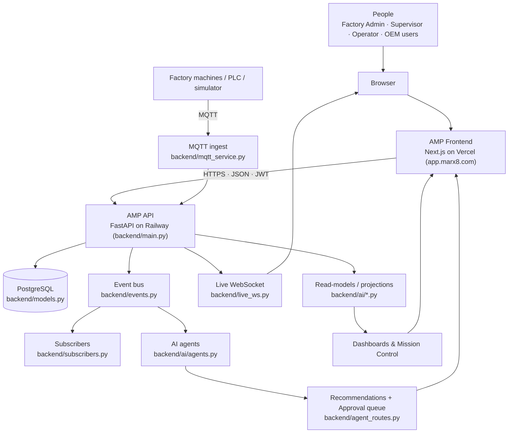

**Reading the diagram (every box and arrow):**
- **People → Browser → Frontend:** users act in a browser; the frontend is the "dining room" they touch.
- **Frontend → API (HTTPS·JSON·JWT):** the frontend never touches the database directly. It sends requests carrying a **JWT** (a signed login badge — Chapter 5) to the API, the "kitchen" where the real rules live.
- **Machines → MQTT → API:** machines (or the built-in simulator) publish readings over MQTT; the API ingests them, writes them down, and rebroadcasts.
- **API → PostgreSQL:** the single source of permanent truth.
- **API → Event bus → Subscribers/Agents:** when something meaningful happens (a work order completes), the API *publishes an event*; subscribers move inventory and agents propose actions — without the original code knowing they exist.
- **API → Read-models → Dashboards:** dashboards don't recompute the whole factory on every click; they read pre-composed *projections* (Chapter 12).
- **Agents → Approval queue → Frontend:** agents *propose*; a human approves (Chapter 13).
- **WebSocket → Browser:** the moment a machine changes, the owning factory's screens update live (Chapter 16).

### Common confusion
- **"AMP is an MES."** It *contains* an MES. The platform (events, tenancy, AI, OEM) is the actual product; the MES is app #1.
- **"An OEM is just another factory."** No — an OEM is a *machine maker* with a deliberately different, cross-tenant identity that **cannot** reach factory data (Chapter 19).
- **"The AI is machine learning."** Mostly **no** — most of AMP's "AI" is deterministic rules and read-models; one feature optionally calls an LLM. We are strict about this in Chapter 13.

### If you want to change this
"What AMP *is*" is expressed in three places you can actually edit: the marketing/landing copy (`frontend/app/page.tsx`), the module catalogue that defines which capabilities exist (`backend/modules.json`, Chapter 8), and the ADRs that record the vision (`docs/adr/`). Changing the *product* means adding a module (Chapter 28), not editing this definition.

### Quick recap
AMP is an **AI operating system for manufacturing** that started as an MES. It closes the factory's "reality vs awareness" gap by capturing machine data (MQTT), remembering it (PostgreSQL + event log), showing it live (WebSocket), and acting on it (event bus + AI agents). It serves **factory users** (Admin/Supervisor/Operator) and, in a separate identity world, **OEM users** (machine makers). The backend (FastAPI) is assembled in `backend/main.py`; the frontend (Next.js) lives in `frontend/`.

---

# Chapter 2 — How AMP Was Built (the real evolution)

### What you will understand
*Why* AMP is shaped the way it is — reconstructed from the actual git history (585 commits) and the 19 ADRs. Understanding the evolution tells you which parts are load-bearing and which are scars from real incidents.

### Simple explanation
AMP was **not** designed on a whiteboard and then built. It grew, painfully, in eras — and inflected sharply on **2026-07-13** when the first Architecture Decision Records were accepted. Before that date it was a well-built app that was improvised; after it, it was an *architecture with a written rationale*, and delivery roughly quintupled.

> **What is an ADR?** *Architecture Decision Record* — a short markdown file that captures one significant decision: the context, the choice, the consequences, the alternatives. AMP has 19 of them in `docs/adr/`. They are the single best map of *why* the system looks like it does. They are never edited once "Accepted" — you supersede with a new one.

### The eras (BEFORE → PROBLEM → CHANGE → AFTER → WHY)

Sources: `docs/ENGINEERING-HISTORY.md` (curated narrative to 2026-07-19) + git history for the July-20→August tail + the ADRs.

**Era 1 — Birth as FlowMES (2026-06-04).**
- **Before:** nothing. **Problem:** SME shop floors have no real-time visibility.
- **Change:** a FastAPI + SQLAlchemy backend and a Next.js dashboard, plus a **PLC simulator** so it could be demoed with no factory attached.
- **After / Why:** established the "monolith-plus-SPA" shape that still holds. The simulator was quietly one of the most consequential decisions — every later demo and most testing depend on AMP being *alive* without hardware.

**Era 2 — The Deploy War (2026-06-18→21).**
- **Problem:** working locally ≠ shipping. **Change:** the friction of getting a Python monolith onto Railway and a Next.js app onto Vercel, talking to each other. Learned expensively: CORS preflight rules (still the shape of today's CORS), the simulation loop moved into FastAPI startup, and the module/pack licensing seed (`modules.json`).
- **Why:** the deployment shape and the CORS config you run today were forged here.

**Era 3 — First customer → multi-tenancy by necessity (2026-06-22).**
- **Before:** one demo factory. **Problem:** **GMATS** (a Bengaluru compressor maker) became the first real pilot — a second company's data now shared one database.
- **Change:** `tenant_code` appeared on tables; logins mapped to tenants via a `CLIENT_TENANTS` dict; isolation was patched into individual queries.
- **After / Why:** multi-tenancy started here — but as *pragmatic patches*, not a system property. That deliberate debt was paid off three weeks later by ADR-0002 (Chapter 17).

**Era 4 — Hardening & the platform layer (2026-06-27→30).**
- **Change:** bcrypt passwords with transparent rehash-on-login; `platform_routes.py` + `TenantConfig` (per-tenant licensing, white-label branding, audit log, `/health`); and the **LLM-optional pattern** — AI is gated on an environment variable and called over plain REST so adding AI can never break the deploy.
- **Why:** turned a demo into a product. The "AI is optional and never load-bearing for the deploy" rule survives to today.

**Era 5 — Rebrand FlowMES → AMP (2026-07-11).** A rename that marked a change of ambition: from a manufacturing execution system to *"an AI operating system for manufacturing."* Two days later the architecture changed to match.

**Era 6 — The ADR inflection (2026-07-13→14).** The most important two days in the repo.
- **ADR-0001 (event bus):** work-order completion's inline BOM movement became a *subscriber* on a new in-process event bus (`backend/events.py`). Behaviour-preserving; possibilities exploded (Chapter 11).
- **ADR-0002 (tenant scoping):** `tenant_code` on core tables + **automatic** query filtering.
- **The only revert in AMP's history** lives here: the first enforcement used `@app.middleware("http")` (Starlette `BaseHTTPMiddleware`), which **deadlocked every POST** in production (`POST /login` hung) while passing all unit tests. Fixed with a pure-ASGI middleware. It produced a standing rule still enforced: *any middleware/auth change must be smoke-tested against a running server, not only unit tests* (`docs/Production-Setup.md`). This is the single best cautionary tale in the codebase.
- **ADR-0003/0004/0005 (AI platform → agents → oversight):** `backend/ai/` created as capabilities that *consume the event stream*; the first agent that *acted* (Maintenance) shipped, then the guardrails (agents *propose*, a human approves) followed two days later.

**Era 7 — The twin & the read-model explosion (2026-07-15→16).** ADR-0006 (Machine Health twin) and ADR-0007 (read-models) named the pattern that had been emerging: a read-model is a pure `build_*` projection that composes signals into one answer, adds no storage, is tenant-scoped, and is tested in isolation. **27 commits on 2026-07-16 alone**, nearly all new read-models + dashboard cards.

**Era 8 — The proactive plant (2026-07-17→18).** The product stopped being dashboards and started telling you what to do: the morning **briefing**, the executive **scorecard**, and the **copilot** that works *without an API key* (a rule-first keyword router over the read-models). Plus operational maturity: `/health`, an end-to-end API test, sliding-session refresh.

**Era 9 — The SaaS machine (2026-07-19).** In one day, the whole commercial lifecycle (formalised as ADR-0008): second-tenant onboarding with founder preview, plan tiers that drive licensing, server-side plan gating, tenant offboarding with an FK-safe purge, and a trial clock. Two of its worst bugs (globally-unique starter inventory codes; the unscoped sim loop animating *every* tenant) were caught by end-to-end verification on production, not tests.

**Era 10 — The LLM, for real (2026-07-19).** Connected a real LLM behind the optional interface, with graceful fallback to the rule-based assistant and a founder-only `/ai/status` error report. A case study in diagnosing an integration you don't control (model-name 404s, free-tier 429s).

**Era 11 — The great modularization (2026-07-20, ADR-0009).** `backend/main.py` had grown to a ~4,000-line "God file." In a single-day sweep, every domain was **extracted into its own `*_routes.py` module** (machines, orders, inventory, quality, work-orders, factory-ops, production-planning, industrial-IoT, operator, costing, read-models, agents, SaaS…). `main.py` became the *assembler* (Chapters 3–4). Also: `/health` hardened to report a dead DB as 503 and to expose the running build's git SHA.

**Era 12 — Security & DevOps tiers (late July → early August).** A security tier (JWT **fail-closed** when `SECRET_KEY` is unset in production, security headers, in-process rate-limiting — Chapter 18) and a DevOps tier (Docker/Postgres parity, backup/restore drills, data-retention jobs, structured logging — Chapters 25–26), plus **Alembic** migrations and **ADR-0018**.

**Era 13 — The `users.is_active` incident & ADR-0018 (2026-08-10→11).** A migration that was *written but never run* in production meant a column the code expected didn't exist — so **nobody could sign in**, yet `/health` still returned 200. The fix (ADR-0018): **migrations run before the application serves.** Taught in full as an engineering lesson in Chapter 6.

**Era 14 — The OEM platform (2026-08-09→16, ADR-0017 & ADR-0019).** The newest and most security-sensitive subsystem: an OEM ownership dimension that *cannot reach factory data* (a reserved sentinel tenant), the **factory-controlled machine claim** (an OEM offers a machine; only the factory can accept it), a **consent** model (the factory switches on exactly what the OEM may see), and service intelligence that refuses to guess. Chapters 19–22.

### Diagram — the evolution

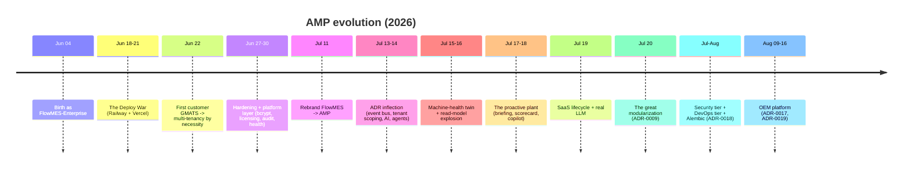

### Example — how to read the history yourself
```bash
git log --oneline --reverse | head -40      # the birth + deploy war
```
Then open `docs/adr/README.md` for the decision spine, and `docs/ENGINEERING-HISTORY.md` for the curated narrative up to 2026-07-19.

### Common confusion
- **"The ADRs are documentation written after the fact."** Some are; but most were accepted *before or alongside* the change and genuinely drove it — the event bus and tenant-scoping ADRs are dated the day the architecture inflected.
- **"The revert means someone was careless."** The opposite — it produced the smoke-test rule that protects every deploy since. Reverts that generate durable rules are how mature systems learn.

### If you want to change this
When you make a significant architectural decision, **add the next ADR** (`docs/adr/00XX-title.md`) following the existing Context → Decision → Consequences → Alternatives → Rollout format, and add a row to `docs/adr/README.md`. Never edit an Accepted ADR; supersede it.

### Quick recap
AMP grew in ~14 eras from a June demo (FlowMES) to today's platform, inflecting on 2026-07-13 when ADR-0001/0002 turned improvisation into architecture. The load-bearing pillars arrived as ADRs: event bus, tenant scoping, AI/agents/oversight, read-models, SaaS lifecycle, modularization, migrations-before-serve, and the OEM platform. The one revert in history gave us the "smoke-test on a running server" rule. The 19 ADRs in `docs/adr/` are your map of *why*.

---

# Chapter 3 — Repository Tour

### What you will understand
Where everything lives, so you never feel lost in 175 backend files + 130 frontend files. The trick: they aren't a pile — they're **layers**.

### Simple explanation
AMP is two programs plus a decision journal:

```
C:\Users\ashwi\AMP
├─ backend/      Python + FastAPI  → the "kitchen" (Railway)
├─ frontend/     Next.js + React   → the "dining room" (Vercel, app.marx8.com)
└─ docs/         Markdown          → runbooks, ADRs, and this training course
```

### The backend in five layers

Think of the backend as a building. Foundation at the bottom, apps in the middle, safety net around everything.

```
 LAYER 5 · Tests (~193 test_*.py + 12 mutate_*.py + 8 audit_*.py) — the net
 LAYER 4 · Backbone / shared services
           events · subscribers · tenancy · module_manifest · ai/ · approvals
           analytics_engine · oee_contract · live_ws · mqtt_service · schema_guard
 LAYER 3 · Domain "apps" (17 *_routes.py + oem/*)
 LAYER 2 · main.py — the assembler ("boot")
 LAYER 1 · Foundation: database · models · schemas · auth · security
```

| Layer | Key files | What it is / when you touch it |
|---|---|---|
| **1 · Foundation** | `database.py` (engine/Session/Base), `models.py` (57 tables), `schemas.py` (Pydantic wire-shapes), `auth.py` + `security.py` (identity) | The plumbing everything imports. Touch `models.py`+a migration to add a table; `schemas.py` to change an API's shape. |
| **2 · Assembler** | `main.py` | Imports everything and wires it (27 `include_router`, subscriber registration, middleware, the sim loop, `/ws/live`). You edit it to **mount a new router** or **add middleware** — rarely for features. |
| **3 · Domain apps** | `machines_routes.py`, `work_orders_routes.py`, `inventory_routes.py`, `quality_routes.py`, `production_planning_routes.py`, `factory_ops_routes.py`, `operator_routes.py`, `reports_routes.py`, `analytics_routes.py`, `costing_routes.py`, `industrial_iot_routes.py`, `users_routes.py`, `platform_routes.py`, `saas_routes.py`, `bom_routes.py`, `enterprise_inventory_routes.py`, `gmats_inventory_routes.py`, plus `oem_routes.py`, `oem_admin_routes.py`, `connected_equipment_routes.py` | One file per business domain. **This is where features live.** Add an endpoint here (Chapter 8). |
| **4 · Backbone** | `events.py`+`subscribers.py` (bus), `tenancy.py` (isolation), `module_manifest.py`+`modules.json` (licensing catalogue), `ai/` (~45 modules), `approvals.py` (the agent gate), `analytics_engine.py`+`oee_contract.py` (OEE), `live_ws.py`+`ws_auth.py` (WebSocket), `mqtt_service.py`+`mqtt_identity.py` (ingest), `schema_guard.py`+`migrate.py`+`alembic/` (migrations) | Shared services that make it a *platform*, not 17 separate apps. Touch with care — everything depends on these. |
| **5 · Tests** | `test_*.py`, `mutate_*.py`, `audit_*.py`, `loadtest.py` | The reason a solo founder can refactor safely. Every feature ships with one. |

**The `ai/` package** (its own folder, ~45 modules) is special enough to call out: `ai/agents.py` (the 5 autonomous agents), `ai/subscribers.py` (event reactions), `ai/copilot.py`+`ai_copilot.py` (the one LLM feature), `ai/assistant.py` (the rule-based copilot), `ai/prediction.py`+`predictive_engine.py` (the rule-based risk scorer), and ~40 `build_*` **read-models** (`ai/twin.py`, `ai/pulse.py`, `ai/oee.py`, `ai/insights.py`, …). Chapters 11–14 live here.

### The frontend in three layers
```
frontend/
├─ app/          pages = routes (page.tsx, login/, dashboard/, oem/, claim/[code]/)
├─ components/   one *Section.tsx / *Snapshot.tsx per domain (mirrors the backend)
└─ lib/          api.ts (the HTTP client), live.ts (the socket), modules.ts, types
```
The `components/` names mirror the backend domains (`InventorySection.tsx` ↔ `inventory_routes.py`) — learn one side and you can navigate the other.

### For each major area — the six questions
| Area | Why it exists | What calls it | What it calls | Modify when… | Don't put here |
|---|---|---|---|---|---|
| `models.py` | Defines the database | Every route, every read-model | PostgreSQL (via SQLAlchemy) | Adding/changing a table | Business logic (models are data only) |
| `*_routes.py` | The HTTP surface of one domain | `main.py` (`include_router`) + the frontend | models, events, `ai/*`, `analytics_engine` | Adding an endpoint/feature | Cross-domain logic (use the event bus) |
| `events.py`/`subscribers.py` | Decoupled reactions | Routes (publish) | Subscribers | Adding a domain event | Anything that must be synchronous with the caller only |
| `tenancy.py` | Multi-tenant isolation | The ASGI middleware + every ORM query | contextvars, SQLAlchemy hooks | **Almost never** — it's load-bearing | New per-request state (use it, don't fork it) |
| `ai/` | Intelligence & projections | `read_model_routes.py`, `analytics_routes.py`, agents | models (read-only) | Adding a dashboard metric or agent | Writes on a read path (read-models never write) |

### Common confusion
- **"Business logic lives in `main.py`."** Not any more — ADR-0009 emptied it into `*_routes.py`. `main.py` is now the *assembler*.
- **"`models.py` and `schemas.py` are the same thing."** No: `models.py` = how data is *stored*; `schemas.py` = how it *crosses the wire* (Chapter 6–7).

### If you want to change this
Adding a *capability* = a new `*_routes.py` + models + a `modules.json` entry + a frontend `*Section.tsx` (Chapter 28). Adding *plumbing* = a backbone file. You almost never edit `main.py` except to mount a router.

### Quick recap
Backend = 5 layers (foundation → assembler → domain apps → backbone → tests); the `ai/` package holds intelligence + read-models. Frontend = 3 layers (app pages → components → lib). Features live in `*_routes.py` and `components/*Section.tsx`; the platform lives in the backbone (`events`, `tenancy`, `ai`, `approvals`, `schema_guard`).

---

# Chapter 4 — How AMP Starts (the boot sequence)

### What you will understand
Exactly what happens between "Railway starts the container" and "AMP is serving traffic" — and the guardrails that make a *broken* start **fail safe and diagnosable** instead of silently serving wrong data.

### Simple explanation
Starting AMP is like opening a restaurant for the day: unlock the doors, **check the kitchen passed inspection** (this is new and important — the schema guard), turn on the equipment (MQTT, the simulation loop), and only *then* let customers in. If inspection fails, the doors stay closed with a sign explaining why — the restaurant does **not** open and quietly serve unsafe food.

### The real sequence (verified `backend/main.py`)

AMP boots in **two phases**: module-import (runs once when uvicorn loads `main:app`) and the ASGI `startup_event` (runs when the server is ready).

**Phase A — module import (top to bottom)**

| Step | File · line | Plain English | If it fails |
|---|---|---|---|
| Load config | `main.py:10` `load_dotenv()` | Read `.env` (local only; Railway injects real env vars) | No-op if absent |
| Wire the event bus | `main.py:82-89` `subscribers.register`, `ai.subscribers.register`, `oem_subscribers.register`, `ai.agents.register` | Connect all 4 subscriber groups to the in-process bus **before the app exists** | Boot aborts |
| **Decide who owns the schema** | `main.py:121-133` `_alembic_manages_this_database()` | Returns `True` iff an `alembic_version` table exists. This one boolean decides everything below. | Unreadable DB → `False` (falls back to old path; guard still refuses traffic) |
| Create tables (dev only) | `main.py:135-136` `if not _MANAGED: Base.metadata.create_all()` | On laptops/tests, create missing tables. **Skipped on Alembic-managed production.** `create_all` never *alters* existing tables — that gap caused the `is_active` outage (Chapter 6). | Boot aborts |
| Boot-time patches (dev only) | `main.py:235-345` ~30× `_ensure_column`/`_ensure_index` + `tenancy.ensure_tenant_columns` + `install_scoping()` | Idempotent "add column/index if missing" + turn on tenant scoping. **Every patch is a no-op on managed DBs.** | Each patch is try/except → logs `[MIGRATE] skipped`, continues; `install_scoping` failure aborts |
| Create the app | `main.py:357` `app = FastAPI(title="AMP API")` | The FastAPI object | — |
| Mount everything | `main.py:361-445` **27× `app.include_router(...)`** + conditional `ai.copilot.register(app)` | Snap all domain apps onto the platform (copilot only if `ANTHROPIC_API_KEY` set) | Boot aborts |
| Build middleware | `main.py:674-717` 6× `app.add_middleware(...)` | PlanGate, SchemaGuard, RateLimit, CORS, SecurityHeaders, RequestContext, **TenantScope** | — |
| Register the socket | `main.py:728` `@app.websocket("/ws/live")` | The authenticated live feed | — |

**Phase B — `startup_event` (`main.py:534-657`)**

| Step | File · line | Plain English | If it fails |
|---|---|---|---|
| **Schema verdict** | `main.py:546-547` `schema_guard.evaluate(engine, force=True)` | Compare the DB's Alembic revision to what this build needs; log it loudly | — |
| **HALT if incompatible** | `main.py:548-556` `if not schema_state["ok"]: return` | **Stop before seeding** — no MQTT, no sim, no data touched. `SchemaGuardMiddleware` 503s all traffic meanwhile | Instance waits in diagnosable refusal until migrated (recovers on next `/readiness` — no restart) |
| Start ingest | `main.py:558` `start_mqtt_service()` | Launch the MQTT subscriber thread | — |
| Start the simulator | `main.py:559` `asyncio.create_task(_simulation_loop())` | The 45-second demo tick (only for demo tenants) | — |
| Seed | `main.py:560-655` GMATS seed, single-shot reseeds, tenant configs, GMATS admin from env | Fill demo/pilot data (all idempotent, all try/except) | `[GMATS SEED ERROR]`, continues |

**Phase C — the simulation loop (`main.py:453-531`)** wakes every **45 s** and, *only for tenants in `sim_state.tenants`* (default: your demo workspace), advances work orders, machine status, production, inventory — so the deployed dashboard is alive without a real factory. A real customer tenant is **never** overwritten.

### Diagram — the safe-start invariant (ADR-0018)

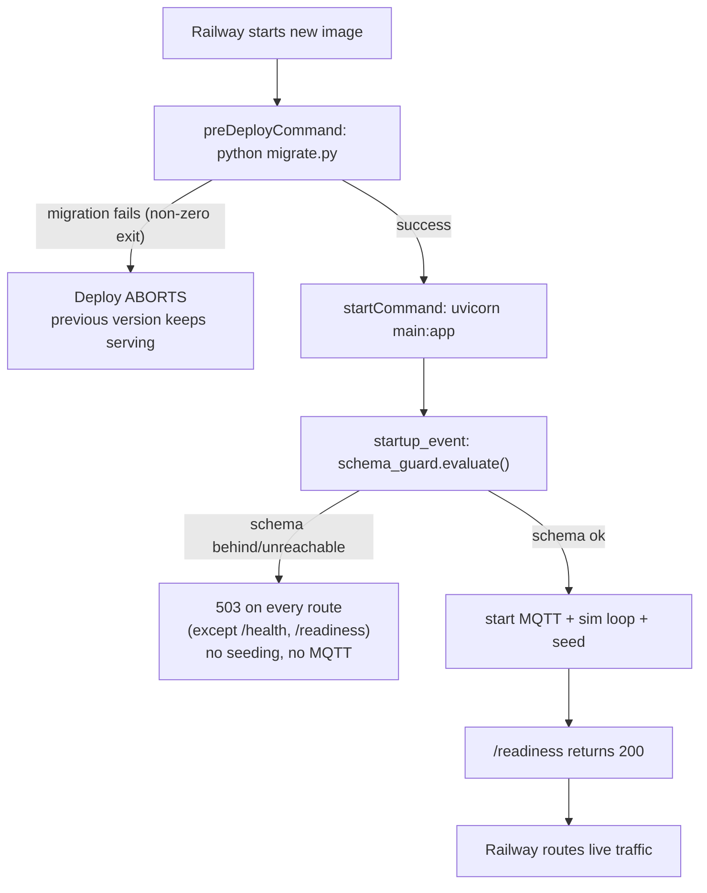

### Common confusion
- **"`/health` being 200 means AMP works."** No — `/health` is *liveness* (`SELECT 1`); `/readiness` is *correctness* (schema at the right revision). The `is_active` outage had `/health` green the whole time. Chapter 6.
- **"Migrations run when the app starts."** They run **before** it starts, in a separate `preDeployCommand`. If they fail, the new version never serves.

### If you want to change this
Change the startup order in `main.py` **only** with the "smoke-test on a running server" rule from ADR-0002 (boot it + `POST /login`). Add a scheduled/background job? There is no worker process (Procfile is `web:` only) — either the 45 s sim loop or a GitHub Actions cron (Chapter 25).

### Quick recap
Boot = module-import (wire bus → decide schema owner → mount 27 routers → build middleware) then `startup_event` (**schema verdict → halt if wrong** → MQTT + sim + seed). The schema guard + `/readiness` mean a mismatched build refuses traffic loudly instead of serving 500s quietly. The sim loop keeps the demo alive for demo tenants only.

---

# Chapter 5 — Follow a Login from Click to Database

### What you will understand
The single most important end-to-end path in AMP, touching every concept: HTTP, JSON, password hashing, JWT, tenancy. Trace it once and the whole system clicks.

### Terms first (plain English)
- **HTTP** — the postal rules browsers and servers use to exchange "requests" and "responses."
- **API** — the menu of requests the server agrees to answer (`POST /login` is one item).
- **JSON** — the text format for the data, like `{"username":"...","password":"..."}`.
- **Password hashing** — we never store your actual password. We store a **bcrypt hash** — a one-way scramble. At login we scramble what you typed and compare scrambles. Even we can't read your password.
- **Authentication** — proving *who you are* (login). **Authorization** — what you're *allowed to do* (roles). Different things.
- **JWT (JSON Web Token)** — a small signed "badge" the server gives you at login. It carries your identity (`sub`, `role`, `tenant`) and is **signed** with a secret so it can't be forged or edited. You show it on every later request. The server trusts the signature, so it doesn't need to remember you between requests (**stateless**).

### The real trace (verified files)

```mermaid
sequenceDiagram
  participant U as User (browser)
  participant FE as frontend/app/login/page.tsx
  participant API as core_routes.py:85 login()
  participant SEC as security.py verify_password
  participant DB as PostgreSQL (users)
  participant AUTH as auth.py create_access_token
  U->>FE: types username + password, clicks Login
  FE->>API: POST /login  {username, password}   (via lib/api.ts)
  API->>DB: SELECT * FROM users WHERE username=?
  DB-->>API: the user row (or none → 401)
  API->>SEC: verify_password(typed, stored_hash)
  SEC-->>API: true / false (401 if false)
  Note over API,DB: if stored hash is legacy SHA-256, re-hash to bcrypt now
  API->>API: resolve tenant (user.tenant_code)
  API->>API: subscription/trial gate (403 if Cancelled/expired)
  API->>AUTH: create_access_token({sub, role, tenant})
  AUTH-->>API: signed JWT (HS256, 4h expiry)
  API-->>FE: 200 {access_token, role, tenant}
  FE->>FE: localStorage.setItem("token", jwt); route to /dashboard
  Note over FE,API: every later request sends Authorization: Bearer <jwt>
```

**Step by step, with code:**
1. **Frontend** (`frontend/app/login/page.tsx`, a `"use client"` page) posts to `/login`; if that fails it *also* tries `POST /oem/login` (two separate user worlds behind one door). The HTTP client is `frontend/lib/api.ts`.
2. **Route** `backend/core_routes.py:85 login()`: looks up the user → **401 "Invalid username"** if none.
3. **Password check** `backend/security.py:23 verify_password`: bcrypt compare. If the stored hash is a legacy 64-hex SHA-256, it verifies that way and then **transparently re-hashes to bcrypt** (`needs_rehash`, `core_routes.py:96`) — zero-impact migration.
4. **Tenant** = `user.tenant_code` (falls back to `CLIENT_TENANTS` for legacy accounts).
5. **Commercial gate** (`core_routes.py:108-115`): if the tenant's registry row says `Cancelled` or `trial_expired` → **403** (audited).
6. **Mint the badge** `backend/auth.py:77 create_access_token`: `jwt.encode({sub, role, tenant, exp=+240min}, SECRET_KEY, HS256)`.
7. **Response**: `200 {access_token, role, tenant}`. The browser stores the token in `localStorage` and every later request attaches `Authorization: Bearer <jwt>` via `getAuthHeaders()`.

**On the next (authenticated) request**, three things happen server-side before your endpoint runs:
- The **TenantScope middleware** (`tenancy.py`) decodes the token *once* and binds your `tenant` for the whole request, so the database automatically shows only your company's rows (Chapter 17).
- `get_current_user` (`auth.py:118`) verifies the signature (401 if bad/expired) and **rejects OEM tokens on factory routes** (403).
- `require_roles([...])` checks your `role` for write endpoints (403 if not allowed).

### Common confusion
- **"The server remembers I'm logged in."** No — it's **stateless**. Your JWT *is* the memory; the server just checks its signature each time. That's why scaling to many server copies is easy (Chapter 17).
- **"The JWT is encrypted."** No — it's **signed**, not encrypted. Anyone can read its contents (the frontend even decodes `role` from it for display); they just can't *change* it without the secret. Never put secrets in a JWT.
- **"`is_active=false` logs a user out."** Surprisingly, **not on ordinary REST routes** — see the honest note in Chapter 18.

### If you want to change this
- Token lifetime: `ACCESS_TOKEN_EXPIRE_MINUTES` in `auth.py` (currently 240).
- Add a login rule (e.g. block a status): edit `core_routes.py login()`, and **mirror it in `/auth/refresh`** (`core_routes.py:138`) — refresh re-derives claims from the DB so a demotion takes effect within one slide.
- Never weaken `security.py` hashing or store a plaintext password.

### Quick recap
Login = `POST /login` → look up user → **bcrypt** verify (legacy hashes auto-upgraded) → tenant + subscription gate → **signed JWT** back → stored in `localStorage` → sent as `Bearer` on every later call, where middleware binds your tenant and `require_roles` guards writes. Stateless, tenant-stamped, role-gated.

---

# Chapter 6 — The Database

### What you will understand
Where AMP's permanent memory lives, how it's shaped, how one column (`tenant_code`) keeps 20 companies' data apart, and the real production outage that taught us to run migrations before serving.

### Terms first (from zero)
- **Database** — an organized, permanent store of data that survives restarts. AMP uses **PostgreSQL** (a powerful, reliable open-source database).
- **Table** — a grid for one kind of thing (the `machines` table). **Row** — one item (one machine). **Column** — one attribute (`status`).
- **Primary key (PK)** — the unique id of a row (`id`). **Foreign key (FK)** — a column pointing at another table's PK (`downtime_logs.machine_id` → `machines.id`), which is how tables link.
- **Index** — a lookup shortcut, like a book's index; makes "find rows where created_at > X" fast instead of scanning everything.
- **Constraint** — a rule the database enforces (e.g. `UNIQUE(tenant_code, work_order_no)` — no two work orders with the same number in one company).
- **Transaction** — a group of writes that all succeed or all fail together (money in, money out — never half).
- **ORM (Object-Relational Mapper)** — a translator so you write Python (`db.query(Machine)`) instead of SQL (`SELECT * FROM machines`). AMP's ORM is **SQLAlchemy**. A Python class = a table; an instance = a row.
- **Migration** — a versioned script that changes the database shape (add a column). **Alembic** is the tool AMP uses to apply migrations in order.

### How AMP implements it
- **`backend/database.py`** — the connection: `engine` (the pooled phone-line to PostgreSQL), `SessionLocal` (hands out a `Session` = one transaction/conversation), `Base` (the parent class every table inherits).
- **`backend/models.py`** — **57 model classes**, one per table, grouped by domain. Each `Column` has a type and rules; `relationship()` expresses "a machine has many downtime logs."
- **`backend/schemas.py`** — Pydantic classes that validate/shape data on the wire (Chapter 7).
- **`backend/alembic/`** — 8 migration files (`0001_baseline` → `0008_machine_claim`), the versioned history of the schema.

### The 57 tables, grouped (verified `models.py`)
| Domain | Tables (model classes) |
|---|---|
| **Identity** | `User` |
| **Factory / machines** | `Machine`, `DowntimeLog`, `MachineEvent`, `FactoryLayoutNode` |
| **Production / orders** | `ProductionRecord`, `ShiftData`, `WorkOrder`, `ProductionPlan`, `ProductionSchedule`, `OperatorJobExecution`, `CustomerOrder`, `BillOfMaterials`, `BomComponent` |
| **Inventory / procurement / costing** | `InventoryItem`, `InventoryTransaction`, `Supplier`, `PurchaseOrder`, `CostRecord`, `DocumentSequence` + enterprise: `Remnant`, `MaterialIssueSlip`, `GoodsReceiptNote`, `GRNItem`, `CycleCount`, `CycleCountItem` |
| **Quality / maintenance / compliance** | `QualityInspection`, `MaintenanceTask`, `ComplianceDocument`, `ReportRequest`, `Notification`, `Alert`, `Escalation` |
| **AI / agents** | `AIRecommendation`, `AgentAction`, `AgentPolicy` |
| **IoT / industrial** | `IoTTelemetry`, `IndustrialDevice`, `IndustrialSignal`, `PlcSignalMapping` |
| **Audit / events** | `AuditLog`, `EventLog` |
| **Platform / SaaS** | `TenantConfig`, `CompanyTenant` |
| **GMATS enterprise inv.** | `GmatsItem`, `GmatsAlias`, `GmatsProforma`, `GmatsProformaLine`, `GmatsInvoice`, `GmatsMIN`, `GmatsMINLine` |
| **OEM platform** | `OemOrganization`, `OemUser`, `MachineModel`, `MachineInstallation`, `OemDataSharingPolicy`, `MachineClaim` |

### Diagram — a core slice
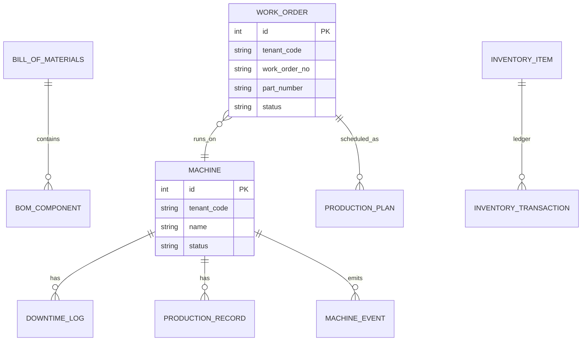

### `tenant_code` — the most important column in AMP
Almost every table carries `tenant_code = Column(String, index=True, nullable=False, default="DEFAULT")`. It stamps **which company owns this row.** GMATS's machines have `tenant_code="GMATS"`; your demo factory's have `"DEFAULT"`. Chapter 17 shows how a single hook uses this column to make Factory A *physically unable* to see Factory B's rows. Two nuances (verified):
- **37 models are auto-scoped** (`tenancy.SCOPED_MODELS`) — the ORM filters them for you.
- A few tenant-owned tables (`AgentAction`, `EventLog`, `User`, the GMATS tables, OEM tables) carry a tenant/oem column but are **filtered explicitly in their routes**, not by the auto-hook. (Flagged in the Observations appendix.)

### Migrations — the two-mechanism reality (ADR-0018)
A database is owned by **exactly one** mechanism, decided by whether an `alembic_version` table exists:
- **Production (Alembic-managed):** schema changes arrive *only* through migration files in `alembic/versions/`. The boot-time `create_all()` and `_ensure_column` patches all stand down.
- **Laptop/tests (unmanaged):** `create_all()` builds the schema from `models.py` directly, so tests always run at model shape.

Deploy order is enforced: **`migrate.py` runs before uvicorn starts** (`railway.toml preDeployCommand`); a failed migration aborts the deploy and the old version keeps serving.

### The `users.is_active` outage — an engineering lesson (2026-08-09)
**What happened:** the approval-gate feature (#506) added `User.is_active` to `models.py` **with an Alembic migration (0005) that nobody ran in production.** The boot-time `create_all()` only creates *missing tables* — it never *alters* the existing `users` table — so the column stayed absent in prod while the code expected it. SQLAlchemy names every column in its `SELECT`, so **every** user query threw `column users.is_active does not exist` → **nobody could log in, for ~a day.**

**Why it hid:** `/health` returned **200** the whole time, because it runs `SELECT 1` (which doesn't touch the ORM). No alarm fired; a human trying to log in found it.

**Why tests were green:** every test builds a *fresh* database with `create_all()` — the one arrangement where `users` is *always* created *with* `is_active`. Model-vs-production drift **cannot** reproduce on a fresh DB.

**The four-layer fix (ADR-0018), each independently sufficient:**
1. Migrations run **pre-deploy** (`migrate.py`), non-zero exit aborts the cutover.
2. **`schema_guard.py`** halts a build whose schema is behind, and 503s all app routes (`behind` = "this is the #513 state").
3. **`/readiness`** (200 only when schema is at head) is what Railway gates traffic on — distinct from **`/health`** (liveness).
4. **One owner per DB** — if `alembic_version` exists, `create_all` + patches stand down, so a column can only arrive via migration.

**The lesson:** *liveness ≠ correctness.* A green health check that bypasses your real code path is worse than none. Verified by `verify_pg_deploy.py`, `test_schema_guard.py`, `test_boot_migrations.py` — which run on **real Postgres** in CI, because SQLite hid the dialect difference.

### If you want to change the database
Add/alter a table = edit `models.py` **and** write an Alembic migration (`cd backend && alembic revision -m "..."`, edit it, it becomes `00XX_*`). Never rely on `create_all` to alter production. Add an index for any column you filter/sort on at scale.

### Quick recap
PostgreSQL holds 57 tables (`models.py`), reached via the **SQLAlchemy ORM**. `tenant_code` stamps ownership on nearly every row. Alembic owns the production schema; migrations run **before** the app serves. The `is_active` outage taught the platform that *liveness ≠ correctness* — now enforced by `schema_guard` + `/readiness`.

---

# Chapter 7 — The Backend (FastAPI)

### What you will understand
How every backend endpoint is written — the one repeating pattern that lets you read all 17 route modules once you've seen one.

### Terms first
- **Route / endpoint** — a function that answers one URL+verb (`GET /inventory/items`).
- **Request / response** — what comes in / what goes back (Chapter 5).
- **Schema (Pydantic)** — a class that **validates** incoming JSON and **shapes** outgoing JSON. If a client sends `utilization: "banana"`, Pydantic rejects it with a clear 422 *before* your code runs.
- **Dependency / dependency injection (`Depends`)** — instead of a function fetching what it needs, it *declares* it and FastAPI supplies it. `db=Depends(get_db)` hands the function a database session; `current_user=Depends(get_current_user)` hands it the verified caller. Analogy: the chef writes "eggs" on the ticket; the kitchen delivers them. Benefit: testable (inject a fake), no globals, reused across 150 endpoints.
- **Model vs schema** — `models.py` = storage shape (DB); `schemas.py` = wire shape (API). Kept separate so you can change storage without breaking the API, and never leak a field (a `User` model has `password`; the response schema omits it).

### The route pattern (learn once, read everything)
Every `*_routes.py` follows this shape (`inventory_routes.py`):
```python
router = APIRouter(prefix="/inventory", tags=["Inventory"])   # a sub-menu main.py mounts

@router.get("/items", response_model=List[schemas.InventoryItemResponse])
def get_inventory_items(
    db: Session = Depends(_get_db),                # injected DB session
    current_user: dict = Depends(get_current_user), # injected, verified caller (any role)
):
    return db.query(models.InventoryItem).order_by(...).limit(500).all()

@router.post("/items", response_model=schemas.InventoryItemResponse)
def create_inventory_item(
    item: schemas.InventoryItemCreate,                       # validated input
    db: Session = Depends(_get_db),
    current_user: dict = Depends(require_roles(["Admin","Supervisor"])),  # role gate → 403
):
    ...
```
Four ideas: **`APIRouter`** (a domain's sub-menu), the **`@router.get/post/patch`** decorator (URL+verb → function), **`Depends`** (inject db/user/role), and the **model↔schema** conversion. That's it — every endpoint is a variation.

### The full request lifecycle (what wraps every call)
```mermaid
flowchart LR
  R["HTTP request + JWT"] --> M1["TenantScope MW<br/>bind tenant"]
  M1 --> M2["SchemaGuard MW<br/>503 if schema wrong"]
  M2 --> M3["RateLimit MW"]
  M3 --> M4["CORS + Security headers"]
  M4 --> M5["PlanGate MW<br/>403 if not licensed"]
  M5 --> EP["endpoint in *_routes.py"]
  EP --> DEP["Depends: get_db, get_current_user, require_roles"]
  DEP --> ORM["db.query(Model) — auto tenant-filtered"]
  ORM --> DB[("PostgreSQL")]
  DB --> SCH["Pydantic response schema → JSON"]
  SCH --> OUT["HTTP response"]
```

**Representative endpoints (verified):**
- `GET /inventory/items` (`inventory_routes.py`) — any signed-in user; returns only *their tenant's* items (the ORM hook adds `WHERE tenant_code=...`); shaped by `schemas.InventoryItemResponse`.
- `POST /work-orders` (`work_orders_routes.py`, Admin/Supervisor) — validated by `schemas.WorkOrderCreate`, saved, tenant auto-stamped on insert.
- `PATCH /work-orders/{id}` → Completed (`work_orders_routes.py:150`) — **publishes `ProductionCompleted`** on the event bus; a subscriber moves inventory per the BOM (Chapters 10–11).

### Common confusion
- **"Why two shapes (model + schema) for one thing?"** Validation, safety (omit `password`), and decoupling. Never return a raw model with secret fields.
- **"Where's the tenant filter in the query?"** You don't write it — the ORM hook adds it automatically for scoped models (Chapter 17). That's *why* a forgotten `.filter(tenant_code=...)` isn't a leak for those tables.
- **"Repository/service layers?"** AMP is pragmatic: most domains put query + logic directly in the route function (thin service). Heavier logic lives in dedicated modules (`analytics_engine.py`, `oee_contract.py`, `bom.py`, `approvals.py`). There is no separate formal repository layer — the ORM `Session` *is* the data-access seam.

### If you want to change this
Add an endpoint → add a `@router.method` function in the right `*_routes.py`, a `schemas.py` shape if the payload is new, and a `require_roles([...])` gate if it writes. Add a whole domain → new `*_routes.py` + `main.py include_router` (Chapter 28).

### Quick recap
Every endpoint = `APIRouter` + `@router.verb` + `Depends` (db, user, role) + model↔schema. Middleware wraps every call (tenant, schema guard, rate-limit, CORS, security headers, plan gate). Pydantic validates in and shapes out; the ORM auto-scopes by tenant. Learn the pattern once; all 17 modules read the same.

---

# Chapter 8 — Every Factory Module

### What you will understand
Every factory-facing module, what it does, where it lives, and — the founder's real question — **where you change code** to add a field, a button, or a rule.

### The universal change-points (true for every module)
Because ADR-0009 made every domain identical in shape, the "where do I change it" answer is the **same everywhere**:
- **Add a field** → column in `models.py` (+ Alembic migration) → field in the matching `schemas.py` class → surface it in the `*Section.tsx` component.
- **Add a button/endpoint** → a `@router.verb` function in that module's `*_routes.py` (+ `require_roles` if it writes) → call it from the `*Section.tsx` via `lib/api.ts`.
- **Change a business rule** → the function inside that `*_routes.py` (or the shared engine it calls: `analytics_engine.py`, `oee_contract.py`, `bom.py`, `approvals.py`).

### Worked example (full format) — Machines
- **MODULE:** Machines / Downtime / Shifts / Production records
- **PURPOSE:** the shop-floor primitives — machine state, stoppages, output.
- **USER:** Operator (records), Supervisor/Admin (manages).
- **SCREEN:** Mission Control, Machine Health, Digital Twin.
- **FRONTEND:** `components/MissionControlSection.tsx`, `MachineHealthSection.tsx`, `DigitalTwinSection.tsx`.
- **API:** `backend/machines_routes.py` — `GET/POST /machines`, `PATCH /machines/{id}/status`, `GET/POST /downtime-logs`, `GET/POST /shifts`, `GET/POST /production-records`, `GET /machine-events`, `POST /machines/import-csv`.
- **BUSINESS LOGIC:** status canonicalised via `machine_status.normalize_machine_status` (bad → 400); utilization clamped 0–100; production records enforce `good+rejected==total`.
- **DATABASE:** `Machine`, `DowntimeLog`, `ShiftData`, `ProductionRecord`, `MachineEvent`.
- **EVENTS PRODUCED:** `DowntimeStarted` (on `POST /downtime-logs`). **CONSUMED:** none.
- **READ MODELS:** `ai/twin.py` (health), `ai/downtime.py`, `ai/oee.py`.
- **AGENTS:** Maintenance + Escalation agents react to `DowntimeStarted`.
- **PERMISSIONS:** reads = any auth; create/delete machine = Admin; status = Admin/Supervisor; downtime/production = +Operator.
- **TENANT ISOLATION:** all five tables in `SCOPED_MODELS` (auto-filtered).
- **TESTS:** `test_machine_*`, `test_core_routes.py`.
- **ADD A FIELD (e.g. `Machine.location`):** `models.py` Machine + migration → `schemas.MachineResponse` → render in `MachineHealthSection.tsx`.
- **ADD A BUTTON:** new `@router.post` in `machines_routes.py` → call from the section.
- **CHANGE A RULE:** edit the handler in `machines_routes.py` (or `machine_status.py` for status vocabulary).

### All modules — compact reference
(Full grid in **AMP-MODULE-MAP.md**. Prefix "—" = router has no prefix.)

| Module | File · prefix | Screen (`components/`) | Events | Writes gated to |
|---|---|---|---|---|
| **Machines/Downtime/Shifts** | `machines_routes.py` · — | MissionControl, MachineHealth | `DowntimeStarted` | Admin/Sup/(Op) |
| **Work Orders** | `work_orders_routes.py` · `/work-orders` | WorkOrdersSection | **`ProductionCompleted`** | Admin/Sup/(Op) |
| **BOM** | `bom_routes.py` · `/bom` (+`bom.py` resolver) | in admin/inventory | consumed by WO completion | **Admin only** |
| **Inventory (basic)** | `inventory_routes.py` · `/inventory` | InventorySection | `InventoryLow` | Admin/Sup/(Op) |
| **Enterprise Inventory** | `enterprise_inventory_routes.py` · — | EnterpriseInventory | none (ledger writes) | Admin/Sup |
| **GMATS Inventory** | `gmats_inventory_routes.py` · `/gmats` | GmatsInventory | none | Admin/Sup |
| **Quality** | `quality_routes.py` · `/quality` | QualitySection | `QualityInspectionFailed` | Admin/Sup/(Op) |
| **Production Planning** | `production_planning_routes.py` · — | ProductionPlan, Scheduling | none | Admin/Sup/(Op) |
| **Factory Ops** (escalations/layout/docs/maintenance/notifications) | `factory_ops_routes.py` · — | Escalation, Documents, Maintenance, Notifications | none | Admin/Sup/(Op) |
| **Operator Terminal** | `operator_routes.py` · `/operator` | OperatorTerminalSection | none | Admin/Sup/Op |
| **Reports/Exports** | `reports_routes.py` · `/reports` | CsvExportsCard | none | Admin/Sup |
| **Costing** | `costing_routes.py` · — | CostingSection | none | Admin/Sup |
| **Industrial IoT** | `industrial_iot_routes.py` · — | IoTCommand, IndustrialConnectivity | none (writes MachineEvent) | Admin/Sup |
| **Users/RBAC** | `users_routes.py` · `/users` | UsersSection | none | **Admin only** |
| **Platform** (licensing/branding/audit/health) | `platform_routes.py` · — | ModuleLicensing, Branding | none | Admin (+founder) |
| **SaaS lifecycle** | `saas_routes.py` · — | SaaSAdminSection | none | Admin **+ founder DEFAULT** |
| **Analytics/Alerts** (read-model surface, 26 endpoints) | `analytics_routes.py` · — | ExecutiveOee, Trends, AIInsights, … | none (read-only) | auth (mgmt = Admin/Sup) |

### Common confusion
- **"Modules talk to each other directly."** Mostly no — cross-domain reactions go through the **event bus** (Chapter 11), which is why completing a work order can move inventory without `work_orders_routes` importing `inventory`.
- **"GMATS Inventory is the generic inventory."** No — it's a *tenant-specialized* module (hard-coded `"GMATS"`). The generic path is `inventory_routes.py` + `enterprise_inventory_routes.py`. (Noted in the Observations appendix against the "build generic" directive.)

### Quick recap
17 factory modules, all built to one shape (ADR-0009). Change points are uniform: field → `models.py`+schema+section; endpoint → `*_routes.py`; rule → the handler/engine. Cross-domain effects flow through events, not direct calls.

---

# Chapter 9 — Inventory Deep Dive

### What you will understand
A concrete trace: *a factory receives 100 bearings, then issues 30 to a job* — through every layer, including the event that wakes the Reorder agent.

### The two buckets
AMP has **two** inventory surfaces (both real):
- **Basic** (`inventory_routes.py`, `/inventory`) — `InventoryItem` (with `current_stock`, `reorder_level`) + an `InventoryTransaction` ledger. This is the generic path and the one the BOM/agents use.
- **Enterprise** (`enterprise_inventory_routes.py`) — GRN (goods receipt), issue slips, remnants (offcuts), cycle counts, variance report, Tally CSV import, with tenant-scoped document numbers (ADR-0012). For factories that run a formal stores process.

### Trace: receive 100 bearings → issue 30

```mermaid
sequenceDiagram
  participant U as Supervisor (UI)
  participant API as inventory_routes.py
  participant DB as PostgreSQL
  participant BUS as event_bus
  participant AG as Reorder agent (ai/agents.py)
  U->>API: POST /inventory/transactions {item, type:"Receive", qty:100}
  API->>DB: item.current_stock += 100 ; INSERT InventoryTransaction
  DB-->>API: committed (tenant auto-stamped)
  U->>API: POST /inventory/transactions {item, type:"Issue", qty:30}
  API->>API: check stock >= 30 (else 400)
  API->>DB: item.current_stock -= 30 ; INSERT ledger row
  alt stock crossed reorder_level (and level configured)
    API->>BUS: publish InventoryLow(item, current_stock, reorder_level)
    BUS->>AG: draft_reorder_on_inventory_low
    AG->>DB: INSERT PurchaseOrder (AUTO-PO, Draft) + AgentAction(Proposed)
  end
  API-->>U: 200 (+ a proposed reorder waiting if low)
```

**Step by step (verified `inventory_routes.py`):**
1. **Receive** — `POST /inventory/transactions {type:"Receive", quantity:100}`: adds to `current_stock`, writes a ledger row. Tenant is auto-stamped on insert (Chapter 17).
2. **Issue** — `type:"Issue", quantity:30`: checks `current_stock >= 30` (else **400**), subtracts, writes a ledger row.
3. **Reorder trip** — if that issue drops stock **to/through `reorder_level`** *and* a reorder level is configured, the route **publishes `InventoryLow`** on the event bus (`inventory_routes.py:226`).
4. **Agent reacts** — the **Reorder agent** (`ai/agents.py draft_reorder_on_inventory_low`) drafts a `PurchaseOrder` (status **Draft**, `AUTO-PO-…`) and records an `AgentAction(Proposed)`. Reorder is the *one* agent auto-approved by default policy — but even auto-approved, the PO stays a **Draft**, never a live order (Chapter 13).
5. **Dashboards** — the low item shows in `ai/inventory.py`/`ai/coverage.py` read-models and the Mission Control `insights` feed.

**Transaction types:** `Receive`/`Return` (add), `Issue` (subtract, stock-checked), `Adjust` (set absolute). Enterprise extras: GRN acceptance is one-shot (status-gated, no double stock movement); cycle-count approval applies variance as a **delta**, not an absolute overwrite.

### If you want to change inventory
- Reorder threshold behaviour → `inventory_routes.py create_inventory_transaction` (the `InventoryLow` trigger).
- Reorder quantity the agent drafts → `ai/agents.py draft_reorder_on_inventory_low` (≈ refill to 2× reorder level).
- A new stock document (like GRN) → `enterprise_inventory_routes.py` + `doc_numbers.allocate`.

### Quick recap
Inventory = `InventoryItem` + an `InventoryTransaction` ledger; issuing below `reorder_level` publishes **`InventoryLow`**, which the **Reorder agent** turns into a *draft* PO for human review. Enterprise inventory adds GRN/issue-slips/remnants/cycle-counts with tenant-scoped document numbers.

---

# Chapter 10 — Production + Work Order + BOM

### What you will understand
How making product actually flows through AMP — and the single best example of *why* the event bus exists: work-order completion moving inventory.

### Terms first
- **Work Order (WO)** — an instruction to make N of a part on a machine; it moves `Planned → In Progress → Completed`.
- **BOM (Bill of Materials)** — the recipe: to make 1 finished unit, consume X of component A, Y of component B. In AMP a BOM belongs to a **tenant** and lives in the **database** (ADR-0013), not in code.

### The flow: make 10 units
```mermaid
sequenceDiagram
  participant U as Operator/Supervisor
  participant WO as work_orders_routes.py
  participant BUS as event_bus
  participant SUB as subscribers.py
  participant BOM as bom.py resolve
  participant INV as InventoryItem/Transaction
  U->>WO: PATCH /work-orders/{id} {status:"Completed", actual_quantity:10}
  WO->>WO: first completion? (completed_at is None)
  WO->>BUS: publish ProductionCompleted(part, qty=10, tenant)
  BUS->>SUB: move_bom_on_production_completed(event, db)
  SUB->>BOM: resolve(db, tenant, part_number)
  BOM-->>SUB: components [(A, 2/unit), (B, 1/unit)]
  SUB->>INV: consume 20×A, 10×B (Issue) ; receive 10× finished (Receive)
  Note over SUB,INV: same DB session → commits atomically with the WO update
  SUB->>BUS: if a component drops below reorder → publish InventoryLow
```

**Step by step (verified):**
1. `PATCH /work-orders/{id}` → `Completed` (`work_orders_routes.py:150`). Guard: fires **only the first time** (`completed_at is None`), so reopen→complete can't double-move material.
2. It **publishes `ProductionCompleted`** (carrying `actual_quantity`, falling back to target only if actual is NULL) — and does **not** know anything about inventory.
3. The subscriber `move_bom_on_production_completed` (`subscribers.py:12`) resolves the tenant's BOM (`bom.resolve` — active revision, `effective_from<=today`, latest wins), **consumes** components and **receives** finished goods, writing ledger rows.
4. Because the subscriber shares the caller's DB session, its writes **commit atomically** with the work-order update — they succeed or fail as one unit.
5. If consumption drops a component to its reorder level, the subscriber **re-publishes `InventoryLow`** → the Reorder agent drafts a PO (Chapter 9). (ADR-0005 confirms this nesting is not a cycle.)
6. The completed run feeds OEE (`good_count/total_count` etc.) and the read-models.

### Old vs new architecture (why this moved to an event)
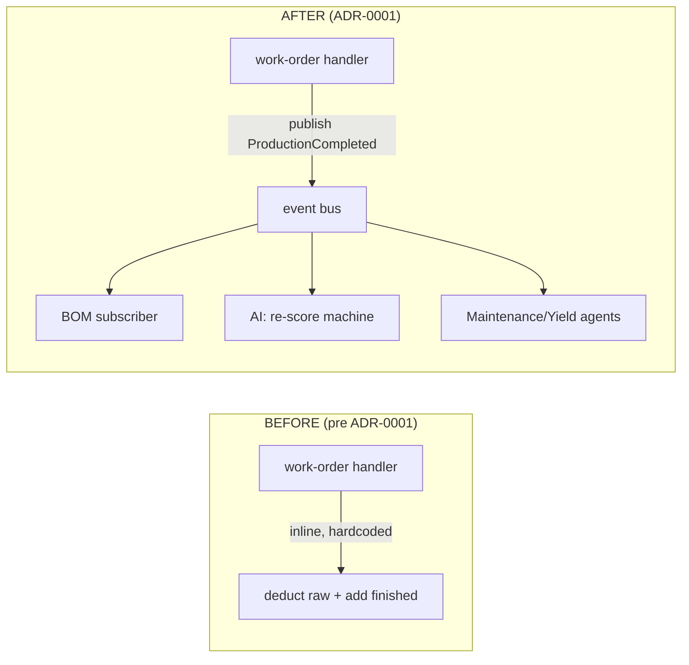
**Before:** the work-order endpoint contained the inventory-movement code directly — tightly coupled, and the *only* thing that could react. **After (ADR-0001):** the endpoint just announces "production completed"; **any number** of independent subscribers react (move BOM, re-score machine risk, assess yield) without the endpoint knowing they exist. The migration was behaviour-preserving — users saw nothing change; the architecture gained the ability to add reactions cheaply. That is the whole point of Chapter 11.

### If you want to change this
- The recipe → `PATCH /bom/{id}` (Admin) — data, not code (ADR-0013).
- What completion *does* → add a new subscriber in `subscribers.py`/`ai/subscribers.py`, don't edit the work-order route (Chapter 11 "add an Energy module").
- BOM resolution rules → `bom.py resolve`.

### Quick recap
A WO moves Planned→Completed; the first completion **publishes `ProductionCompleted`**, and a *subscriber* consumes components + receives finished goods per the tenant's database BOM, atomically. This inline-logic-became-an-event refactor (ADR-0001) is the model for every future cross-domain reaction.

---

# Chapter 11 — The Event Bus

### What you will understand
AMP's internal "noticeboard" — how one part of the system announces that something happened, and other parts react, **without being wired directly to each other.**

### The problem without one (real-life analogy)
Imagine a factory office where, when a work order finishes, the person who closes it must **personally walk to** the stores clerk, the maintenance planner, and the buyer to tell each one. Add a new department (say, Energy) and you must find and edit *that walking routine* to add another stop. Fragile, and everyone is coupled to everyone.

A **noticeboard** fixes it: the closer pins one note — *"WO-1055 completed, 10 units."* Whoever cares (stores, maintenance, buyer, and tomorrow Energy) reads the board and reacts. The closer doesn't know or care who's listening. Adding a department means adding a reader, **not** editing the closer.

That noticeboard is an **event bus**.

### Terms first
- **Event** — an immutable fact that *already happened*, named in past tense (`ProductionCompleted`). It carries data (part, quantity, tenant) and never changes.
- **Publisher / producer** — the code that announces the event.
- **Subscriber / handler** — a function that reacts to a kind of event.
- **Event log** — a permanent, append-only record of every event (the `event_log` table) — the factory's history and the substrate for AI.

### How AMP implements it (`backend/events.py`)
- **`EventBus`** holds `{event_type: [handlers]}`. `subscribe(Type, handler)` registers; `publish(event, db)` does two things in order: (1) **append the event to `EventLog`**, (2) synchronously call every handler as `handler(event, db)`.
- **Synchronous, in-process, shared DB session.** Handlers receive the producer's `db`, so their writes **commit atomically** with the producing action — the work order and its inventory movement succeed or fail as one transaction.
- **Errors propagate by design** — a failing subscriber rolls back the whole thing. (This is why so much subscriber code is defensively NULL-guarded — an unguarded crash would 500 the producing write.)
- **Built to outgrow itself:** the transport hides behind the `EventBus` interface, and every event carries `event_type` + `event_version`, so it "can move to an outbox + broker (Kafka/NATS/Redis) later **without changing a single producer or subscriber**." (ADR-0001.)

### The event catalog (verified)
| Event | Producer | Subscribers → effect |
|---|---|---|
| **ProductionCompleted** | `work_orders_routes.py:150` (WO→Completed, first time) | `subscribers.move_bom_on_production_completed` (consume components + receive finished; may re-publish `InventoryLow`); `ai.subscribers.recommend_on_production_completed` (maintenance rec if risk≥55); `ai.agents` Maintenance + Yield agents |
| **DowntimeStarted** | `machines_routes.py:165` (`POST /downtime-logs`) | `ai.subscribers.recommend_on_downtime_started`; Maintenance agent; Escalation agent (≥3 in 30 days) |
| **InventoryLow** | `inventory_routes.py:226` (stock crosses reorder); also re-published in `subscribers.py:97` | `ai.subscribers.recommend_reorder_on_inventory_low`; Reorder agent (drafts PO) |
| **QualityInspectionFailed** | `quality_routes.py:115` (`failed_quantity>0`) | `ai.subscribers.recommend_on_quality_failed`; Quality agent |
| *OEM family* (`oem_events.py`): MachineInstalled, MachineClaimed, MachineCommissioned, ServiceCompleted | `oem_routes.py` / `connected_equipment_routes.py` | **`oem_subscribers.py` handles all four** — each writes a `Notification`. `MachineClaimed` writes **two**: one into the factory's tenant and one into the manufacturer's sentinel `OEM:<code>` (`oem_subscribers.py:102-130`) |

Wiring happens once at startup: `subscribers.register()`, `ai.subscribers.register()`, `ai.agents.register()`, `oem_subscribers.register()` (`main.py:82-89`).

### Diagram
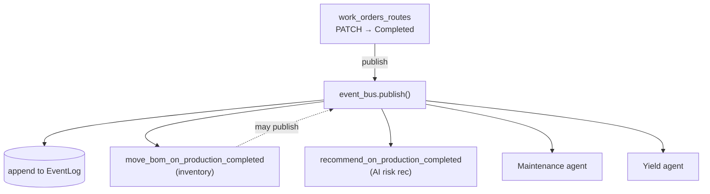

### The founder's question — "add an Energy module that reacts to completion"
You would **not** touch `work_orders_routes.py`. You would:
1. Write a handler `record_energy_on_production_completed(event, db)` in a new `ai/energy.py` (or `subscribers.py`).
2. Register it: `event_bus.subscribe(ProductionCompleted, record_energy_on_production_completed)` inside a `register()` called at startup.
That's it — the producer is untouched, and every other subscriber keeps working. *That* is the payoff of the event bus.

### Common confusion
- **"Events are asynchronous/queued."** Today they're **synchronous and in-process** — handlers run inline, inside the producer's transaction. The *design* allows a broker later, but it isn't one now.
- **"The event log is just logging."** It's a first-class, append-only history that the `insights` feed reads and that ADR-0003 calls the compounding data moat.

### Quick recap
The event bus is AMP's noticeboard: producers `publish` past-tense facts; subscribers react; everything is appended to `EventLog` and runs synchronously in the producer's transaction. Four core events drive inventory, AI recommendations, and agents. Adding a reaction = adding a subscriber, never editing the producer.

---

# Chapter 12 — Read Models

### What you will understand
Why AMP's dashboards are fast and always consistent — and what a "read model" really is (it's not a cache and not a table).

### The problem (analogy)
A CEO who wants a one-page morning summary doesn't make every department **re-audit the whole company** each time they ask. Someone prepares a **standing summary** that *composes* the latest numbers into the few answers that matter. A **read model** is that prepared summary — except it's recomputed fresh each time it's asked, so it can never be out of date.

### Terms first
- **Raw records** — the rows in `models.py` (individual downtime logs, production records).
- **Read model / projection** — a pure function that *composes* raw records (and other read models) into **one object that answers one question** ("how healthy is each machine?"). It **stores nothing** and **writes nothing**.
- The chain: **raw records → (event updates them) → read model composes → dashboard renders.**

### How AMP implements it (ADR-0007)
A read model in AMP is a `build_*(db, tenant)` function in the `ai/` package that:
1. **Composes** signals from existing tables (and other read models),
2. **Adds no storage** — recomputes on every read, so *there is nothing to invalidate; it can't go stale*,
3. Is **tenant-scoped**,
4. Is **exposed 1:1** at a GET endpoint (`read_model_routes.py` is ~45 one-line delegations to `ai.<module>.build_*`),
5. Is **unit-tested in isolation**.

The concrete engine hides behind the function, so "rules → ML → LLM" can change later without any caller changing.

### The major read models (INPUT → PROCESS → OUTPUT → USED BY → CODE)
| Read model | INPUT → PROCESS → OUTPUT | Used by | Code |
|---|---|---|---|
| **twin** (Machine Health) | machines + risk + downtime + tasks → `health = 100 − risk`, band it, attach 7-day OEE → per-machine snapshot | `/machine-health`, cockpit, pulse | `ai/twin.py` |

> **Measured and fixed, 2026-09-01.** `build_twins` used to issue **three queries per machine** (downtime, open tasks, pending actions), so a 200-machine plant cost **607 statements every three seconds** — the dashboard polls this on a 3s timer. Now batched into three grouped queries: **607 → 10, flat at any fleet size** (`test_machine_health_query_count.py` fails the build if per-machine growth returns). This is the first thing in AMP that has ever actually been measured — see `docs/PERFORMANCE.md`.
| **pulse** | composes `twin` + `impact` → the owner's command header | Mission Control | `ai/pulse.py` *(a read-model over read-models)* |
| **insights** | open recommendations + notable events + proposed agent actions → one time-sorted feed | Mission Control | `ai/insights.py` |
| **impact** | GROUP BY on `agent_actions` → outputs produced, auto-approval rate, backlog | agent oversight | `ai/impact.py` |
| **oee / losses / recovery** | production records → pooled OEE + loss breakdown + £ recovery prize | Executive OEE, scorecard | `ai/oee.py`, `analytics_engine.py` |
| **Pillar family** (windowed SQL aggregations) | downtime/reliability (MTBF/MTTR), quality, production, inventory/coverage/stock_health, delivery, cost, maintenance, compliance, escalations, workforce, connectivity, trace, scorecard, briefing, handover | each pillar's dashboard | `ai/<name>.py` |

### Diagram
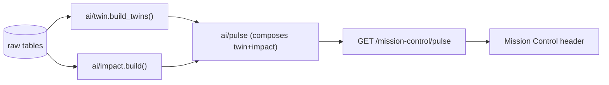

### Common confusion
- **"A read model is a cache."** No — a cache can go stale and needs invalidation. A read model **recomputes on every request**, so it's *always* consistent with the tables. The cost is recompute-per-request (accepted at SME scale; ADR-0007 documents a path to materialise later behind the same signature).
- **"Read models write data."** Never. They are pure reads. If you find a write on a read path, that's a bug.

### If you want to add a dashboard metric
Write a `build_mymetric(db, tenant)` in `ai/mymetric.py` → add a one-line GET in `read_model_routes.py` → add a `MyMetricSnapshot.tsx` that fetches it (Chapter 23). No new tables, no migration.

### Quick recap
A read model is a pure `build_*` projection that composes raw records into one answer, stores nothing, and can't go stale. ~45 of them live in `ai/` and are exposed 1:1 by `read_model_routes.py`. `pulse` composing `twin`+`impact` shows they're composable. Dashboards read these, not raw tables — that's why they're fast and consistent.

---

# Chapter 13 — AI + Agents

### What you will understand
Exactly what AMP's "AI" is and is not — so you can describe it honestly to an investor or a CTO — and how the five autonomous agents observe, propose, and act **only under human oversight.**

### The honest classification (memorise this — it protects your credibility)
AMP's intelligence is **three distinct things**, and it matters not to blur them:

1. **Rule-based / deterministic — ~95% of "AI" in AMP.** Hand-written thresholds and SQL aggregations. Example: the "predictive maintenance" score (`predictive_engine.calculate_predictive_risk`) is a sum of fixed weights — `Breakdown +35`, `utilization<40 +20`, `reject≥8% +20`, … capped at 100, banded Critical/High/Medium/Low. **The constants are hand-tuned, not learned.** All ~40 read-models are deterministic arithmetic.
2. **LLM-backed — exactly ONE feature, off by default.** `backend/ai_copilot.py` (wrapped by `ai/copilot.py`) is the *only* code that calls an external Large Language Model. It POSTs to Anthropic's API (or Google Gemini as a demo-only alternative) over plain `urllib`. It's enabled **only** when `ANTHROPIC_API_KEY` (or `GEMINI_API_KEY`) is set; default model `claude-haiku-4-5`. It reasons over a text context **built from the same rule-based read-models**, is never on a write path, and **falls back to the rule-based assistant** (labelled `"source":"rules"`) if the key is absent or the call fails. Surfaces at only 3 endpoints: `/ai/status`, `/ai/ask`, `/ai/report`.
3. **Trained machine-learning models — NONE.** > **AMP currently has no trained ML models.** Verified: no `sklearn`/`numpy`/`torch`/`tensorflow`/model artifacts anywhere in `backend/`. What's marketed as "predictive" is the deterministic threshold scorer in (1). The architecture is *designed* so a scorer could become an ML model later without callers changing (ADR-0003) — but that has not happened.

> **Naming trap:** `ai/copilot.py` (the LLM) and `ai/assistant.py` (rule-based keyword router) are **both** called "copilot" in the UI. `/ai/ask` = LLM with rules-fallback; `/ai/copilot/ask` = rules only. The rule-based one is what demos with zero cost and zero dependency.

### The five agents (`backend/ai/agents.py`)
An **agent** is a bus subscriber that watches events, applies a rule, and **proposes** an action into a pending state — never acting live without oversight.

| Agent | Watches | Rule (constant) | Proposes | Auto-approved by default? | Human approval |
|---|---|---|---|---|---|
| **Maintenance** | ProductionCompleted, DowntimeStarted | risk ≥ **75** (`CRITICAL_RISK`) | `MaintenanceTask` (Proposed) | No | **Yes** |
| **Quality** | QualityInspectionFailed | fail rate ≥ **10%** | `MaintenanceTask` (Proposed) | No | **Yes** |
| **Reorder** | InventoryLow | any low-stock; qty ≈ refill to 2× reorder | `PurchaseOrder` (**Draft**) | **Yes** (reversible draft) | No (but stays Draft) |
| **Escalation** | DowntimeStarted (+ morning briefing) | ≥ **3** downtimes in **30 days** | `Escalation` (Proposed) | No | **Yes** |
| **Yield** | ProductionCompleted | good-rate < **85%** over ≥ **50** units | `MaintenanceTask` (Proposed) | No | **Yes** |

Autonomy is per-tenant policy (`AgentPolicy`, set via `PUT /agent-policy`, Admin-only); the env default `AUTO_APPROVE_AGENTS` is just `reorder`. Constants live at the top of `ai/agents.py`.

### The oversight loop (observe → reason → propose → log → approve → execute)
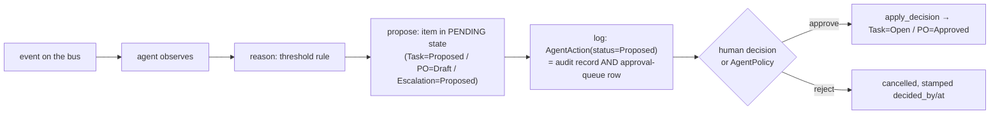

**The gate — `backend/approvals.py` (ADR-0015), the load-bearing safety control.** `authorise(db, action, actor, decision)` is called by **both** the HTTP route (`POST /agent-actions/{id}/approve|reject`, gated Admin/Supervisor) **and** `apply_decision` itself — so you cannot reach past the route to skip it. Four ordered checks: (1) action belongs to actor's tenant → 404; (2) still `Proposed` → 400; (3) not past expiry → 409; (4) approver still exists, active, in-tenant, holds an approving role — **re-checked against the DB, not the JWT** → 401/403. The ordering is itself a guard (tenant first, so a cross-tenant probe only ever sees 404). Auto-approval is still approval: it passes 1–3 and skips only the human check (a human pre-decided via policy); **expired proposals are never auto-approved.**

### Where you see it
`/agent-actions` (log + queue), `/agent-actions/stats`, `/agent-roster` (per-agent cockpit), `/agent-policy` (autonomy), plus the Mission Control `insights` feed and each machine cockpit's `open_actions`. Frontend: `MissionControlSection.tsx`, `AgentActivitySection.tsx`, `ApprovalsInbox.tsx`, `AgentPolicyPanel.tsx`.

### Common confusion
- **"AMP uses machine learning to predict failures."** No — it uses a **deterministic risk score** (hand-tuned thresholds). Say "rule-based predictive scoring," not "ML."
- **"Agents act on their own."** Only Reorder is auto-approved by default, and even then it produces a **Draft** PO, never a placed order. All others wait for a human.
- **"The copilot needs an API key."** The *LLM* copilot does; the *rule-based* assistant (which powers most of the chat experience) does not.

### If you want to change/add an agent
Add a handler in `ai/agents.py`, register it on the relevant event in `ai/agents.register()`, route its proposal through `_propose()` + `AgentAction`, and it inherits the whole approval/oversight machinery for free. Tune a threshold = edit the constant at the top of `ai/agents.py`.

### Quick recap
AMP's "AI" = mostly **deterministic rules** + read-models, **one optional LLM** feature (off without a key, always with a rules fallback), and **no trained ML**. Five agents observe events and **propose** actions into a pending state, logged as `AgentAction` rows that are simultaneously audit trail and approval queue; the `approvals.py` gate (re-checking the DB, not the token) makes a human the authority. Only Reorder auto-approves, and only into a Draft.

---

# Chapter 14 — Digital Twin / Machine Health

### What you will understand
What AMP genuinely means by "Digital Twin" (and what it deliberately does *not* claim), and how raw data becomes the Machine Health view.

### Simple explanation — set expectations honestly
In heavy industry, "digital twin" sometimes means a full physics simulation of a machine. **AMP does not claim that.** AMP's twin is a **live, per-machine health snapshot** — a composed *read model* (Chapter 12) over data AMP already has: current state, a risk-derived health score, recent downtime, open tasks, pending agent actions, and recent OEE. No new storage, no physics model. Describe it as *"a live health dashboard per machine,"* not *"a simulation."*

### Raw vs derived vs rule-based vs display
| Layer | What | Where |
|---|---|---|
| **Raw data** | machine status, utilization, downtime logs, production records, telemetry | `Machine`, `DowntimeLog`, `ProductionRecord`, `IoTTelemetry` (fed by MQTT, Chapter 15) |
| **Derived (rule-based)** | risk score (threshold sum), `health = 100 − risk`, 7-day OEE, band (Critical/High/Medium/Low) | `predictive_engine.py`, `ai/twin.py` |
| **Composed** | one snapshot combining health + downtime + open tasks + pending agent actions | `ai/twin.build_twins` / `build_machine_detail` |
| **Display** | the fleet grid + a per-machine cockpit drawer | `MachineHealthSection.tsx`, `MachineDetailDrawer.tsx` |

### One machine, end to end
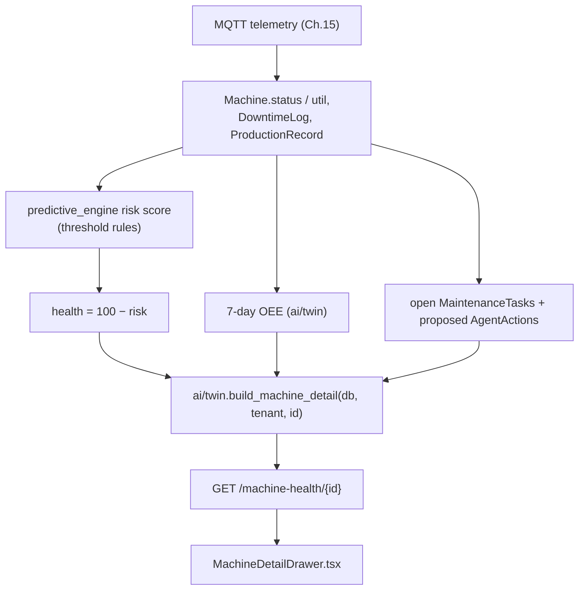
So a machine that just logged a breakdown gets a higher risk score → lower health → surfaces in the twin heat-map → the Maintenance agent may propose a task → all visible in the cockpit drawer. It's the same rule-based scoring from Chapter 13, *composed* into a per-machine view.

### Common confusion
- **"The twin predicts the future / simulates the machine."** No — it *scores current risk* from recent data with fixed rules and shows it live. It's honest health, not prophecy.
- **"Machine Health is stored."** No — it's a read model, recomputed per request (Chapter 12).

### If you want to change the twin
Health formula/bands → `ai/twin.py` (+ `predictive_engine.py` for the risk inputs). A new field on the cockpit → add it to `build_machine_detail` and render it in `MachineDetailDrawer.tsx`.

### Quick recap
AMP's Digital Twin is a **live per-machine health read-model** (`health = 100 − rule-based risk`, plus recent OEE, downtime, and open/pending actions), not a physics simulation. Raw MQTT/production data → rule-based risk → composed snapshot (`ai/twin.py`) → cockpit UI. Honest, useful, and cheap — and clearly labelled so you never oversell it.

---

# Chapter 15 — MQTT and Machine Data

### What you will understand
How a reading from a machine gets into AMP — and the honest truth about which industrial protocols are *really* implemented versus simulated.

### Terms first
- **MQTT** — a lightweight messaging protocol built for machines/IoT. Think of it as a **postal system for tiny messages.**
- **Broker** — the post office. Everyone connects to it; it routes messages. AMP expects one at `MQTT_BROKER` (default `127.0.0.1:1883`).
- **Publisher** — a machine (or simulator) that *sends* a message. **Subscriber** — AMP, which *receives* them.
- **Topic** — the address a message is filed under, like a folder path. AMP's shape: **`flowmes/{tenant}/{site}/machines`**.
- **Payload** — the message body (JSON): the machine's status, utilization, counts.

### The real pipeline (verified `backend/mqtt_service.py`)

> **Corrected 2026-09-01.** This section previously called the pipeline
> "production-grade" without qualification. Two things were wrong.
> **(1)** `safe_broadcast` wrapped a *synchronous* callee in `asyncio.run(...)`,
> so every message raised `ValueError: a coroutine was expected, got None` —
> swallowed and logged — and the delivery that did happen ran on a throwaway
> event loop rather than the server's. Fixed: `live_ws.bind_loop()` captures the
> server loop at startup and the bridge uses `run_coroutine_threadsafe`
> (`test_live_broadcast_bridge.py`).
> **(2)** the ingest published **no domain events at all**, so machine-reported
> breakdowns never reached the bus and the Escalation agent was blind to them.
> Fixed: `DowntimeStarted` is now published on the same transition that writes
> the `DowntimeLog` (`test_mqtt_publishes_downtime.py`).
```mermaid
flowchart LR
  M["machine / simulator"] -->|"publish to flowmes/DEFAULT/-/machines"| B["MQTT broker"]
  B -->|"subscribe flowmes/+/+/machines"| ING["mqtt_service.on_message"]
  ING --> RT["mqtt_identity: parse topic → (tenant, site)"]
  RT --> GATE["tenant provisioned? else DROP"]
  GATE --> BIND["set_current_tenant(tenant)"]
  BIND --> UP["get_or_create_machine(tenant, site, name)<br/>update status/util; write MachineEvent/ProductionRecord/DowntimeLog"]
  UP --> BC["broadcast machine_update (carries tenant_code)"]
  BC --> WS["live_ws → the owning factory's browsers (Ch.16)"]
```
A real payload (from `mqtt_machine_publisher.py`):
```json
{"machine":"CNC-01","status":"Running","utilization":72,
 "total_count":480,"good_count":468,"rejected_count":12,
 "planned_minutes":480,"runtime_minutes":410,"ideal_cycle_time_seconds":60}
```
Guards that make it robust: unknown status / non-finite numbers leave the prior value untouched; a `MachineEvent` is written only on a status *change*; a `DowntimeLog` only on the *transition into* Breakdown (so MTBF/MTTR aren't inflated); production only when `good+rejected==total`.

### Machine identity — why name-alone was unsafe (ADR-0011)
`Machine.name` ("CNC-01") is a **label**, not a key — three customers each have one. The old code matched on name with **no tenant filter**, and the MQTT thread has no bound tenant, so a breakdown packet from Factory B once flipped Factory A's "CNC-01" to Breakdown, and child rows fell back to a third tenant (`DEFAULT`). Silent, cross-tenant corruption.

**The fix:** identity is the triple **(tenant_code, site, name)**, enforced by a DB `UNIQUE` constraint. The **tenant comes from the topic, never the payload** — the topic segment is broker-ACL-enforced; a `"tenant"` field in the JSON body is *rejected* if it disagrees with the topic. Unroutable/unprovisioned/contradictory messages are **dropped with a logged reason** (fail-closed).

### The honest adapter classification (verified `industrial_adapters.py` + `requirements.txt`)
This is critical for talking to OEM engineers and technical customers. **The MQTT pipeline and the live WebSocket are real, working code.** What is *simulated* today is the **PLC-protocol layer**: `get_adapter()` unconditionally returns a `SimulatorAdapter` whose `read()` is `random.randint(...)`. **No PLC driver library is installed** (no `asyncua`/`pymodbus`/`snap7`/`pycomm3`/`pyads`).

| Protocol / path | Status |
|---|---|
| **MQTT ingest** (broker→DB→broadcast) | ✅ **WORKING REAL** (paho-mqtt installed). Note: MQTT is *optional* infrastructure — `monitoring.py` reports `not_configured` when `MQTT_BROKER` is unset, and **production currently has no broker reachable**, so this path is correct but not exercised live |
| **Live WebSocket `/ws/live`** | ✅ **WORKING REAL** (FastAPI native + auth) |
| **HTTP/REST IoT ingest** (`POST /iot/telemetry`, `/industrial/signals`) | ✅ **WORKING REAL** (internal authenticated API) |
| **OPC-UA, Modbus, Siemens S7, Allen-Bradley/EtherNet-IP, Beckhoff ADS, Omron FINS** | ⚠️ **SIMULATOR** — advertised in the `PROTOCOLS` table; real driver is **PLANNED / requires per-OEM edge agent**. No protocol client present. |
| **PROFINET, EtherCAT, CANopen** | ❌ **NOT IMPLEMENTED** (appear only as test inputs that fall back to Modbus) |

The adapter layer is a genuine, clean **framework** — `read()` is the single seam a real driver would override — but **there is no real PLC connectivity in the product today**; the "6 protocols supported" surface is backed by simulators pending OEM edge-agent work (`docs/sales/REAL-OEM-INPUT-REQUIRED.md`). Say: *"MQTT/HTTP telemetry is live; direct PLC protocols are simulated behind a ready adapter interface."*

### If you want to change ingest
Payload shape/guards → `mqtt_service.on_message`. Topic/identity rules → `mqtt_identity.py`. A **real** protocol driver → implement `read()` on a new adapter in `industrial_adapters.py` and register it in `get_adapter()` (this is the OEM edge-agent work).

### Quick recap
Machine data arrives over **MQTT** on `flowmes/{tenant}/{site}/machines`; `mqtt_service` routes by **topic** (tenant is trusted from the topic, not the body), resolves identity as **(tenant, site, name)** (ADR-0011), writes it down, and broadcasts to the owning factory's browsers. MQTT/WS/HTTP ingest are real; **all direct PLC protocols are simulators today.**

---

# Chapter 16 — WebSockets

### What you will understand
How AMP pushes a change to the browser the instant it happens, and why that needs something HTTP can't do.

### The problem (why not just HTTP)
Normal HTTP is **one question, one answer** — the browser must *ask* before it learns anything. To show live machine states, the browser would have to ask "any changes?" every second (polling) — wasteful and always a bit stale. A **WebSocket** is a **phone line left open**: the server can *speak whenever it wants*, so a machine change reaches the screen immediately.

AMP actually does **both**: a WebSocket for instant pushes, and a 3-second poll as a safety net.

### The flow (verified `main.py:728`, `live_ws.py`, `ws_auth.py`)
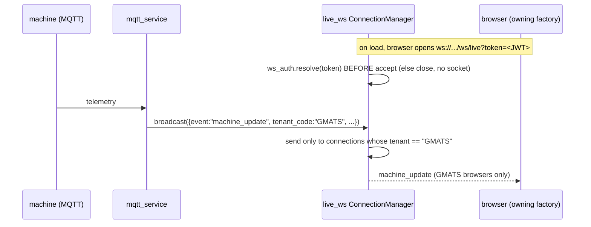

**Authentication before accept (ADR-0016).** Browsers can't set headers on a WebSocket handshake, so the JWT is passed as `?token=`. `ws_auth.resolve` **raises unless** the token is valid, unexpired, names a real, **active** user, and its claimed tenant **matches the account's own** `tenant_code` (the tenant used is read from the **DB row, not the token**). A refusal `close()`s *before* `accept()` — no socket to leak. Close codes tell the client what to do: `4401` (re-auth — new token works), `4403` (stop retrying — account gone/disabled), `4400` (no client frames allowed).

**Tenant isolation.** The `ConnectionManager` stores `(websocket, tenant)` pairs; `broadcast(payload)` sends **only** to connections whose tenant equals `payload["tenant_code"]` — so GMATS telemetry never reaches a DEFAULT browser. The server accepts **no inbound frames** (it's a one-way feed; any client frame closes the socket).

**The incident that hardened it (#507):** before ADR-0016, auth failed *open* — an undecodable token bound `None` and the socket was accepted anyway, so **a deleted user's token kept streaming their old factory's live telemetry** until it expired. Now a deleted/disabled account is refused at the handshake within one reconnect.

### If you want to change the live feed
Broadcast shape → the `machine_update` dict in `mqtt_service.py` (must carry `tenant_code`). Handshake rules → `ws_auth.py`. Client reconnect/backoff → `frontend/lib/live.ts`.

### Quick recap
A WebSocket keeps a line open so the server pushes changes instantly; AMP authenticates the JWT **before accepting** (ADR-0016), stores `(socket, tenant)` pairs, and broadcasts each update **only to its owning tenant's** browsers. HTTP polling every 3 s is the backup.

---

# Chapter 17 — Multi-tenancy

### What you will understand
The single most important safety property in a SaaS platform: **why Factory A can never see Factory B's data** — traced through every layer.

### The scenario
Factory A and Factory B are both AMP customers on the same servers and the same database. **Both have a machine called "Machine 1."** When Factory A's supervisor opens the dashboard, they must see *only* A's Machine 1 — never B's. That guarantee is **multi-tenancy**, and AMP enforces it in depth.

### Terms first
- **Tenant** — one customer company (a "factory"). Identified by a short `tenant_code` (`DEFAULT`, `GMATS`, …).
- **Tenant isolation** — the guarantee that every request only ever touches its own tenant's rows. Analogy: every request wears a **security badge** naming its factory, and every door checks it automatically.
- **Fail closed** — when something is ambiguous, deny (show nothing), never allow. The safe default.

### How AMP implements it (verified `backend/tenancy.py`)
The badge is set once per request and then **the database enforces it automatically** — you don't hand-write the filter.

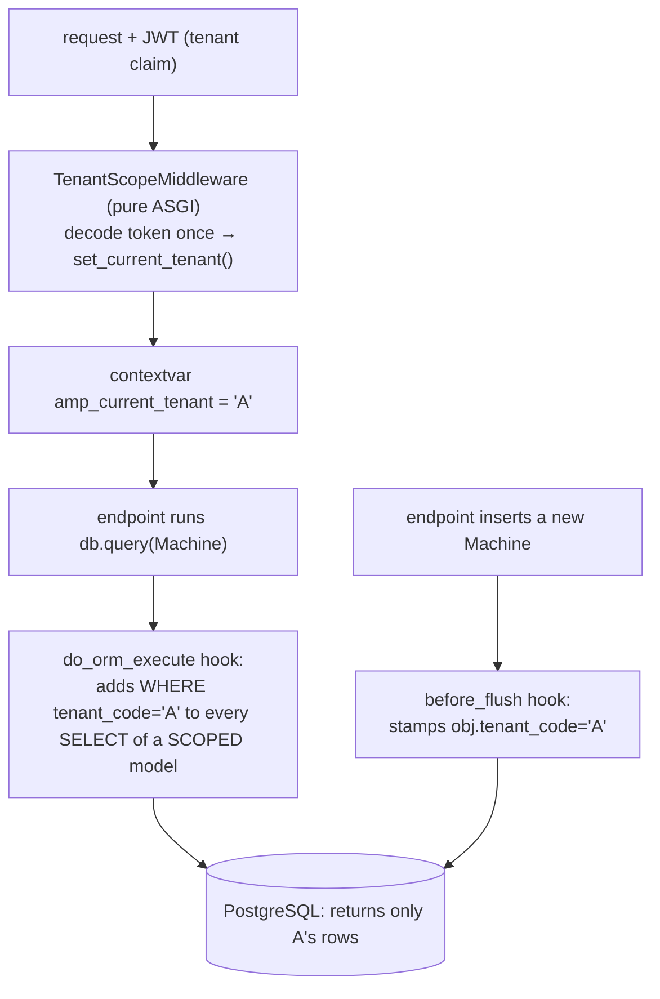

1. **Bind the badge.** The `TenantScopeMiddleware` (a *pure-ASGI* middleware — deliberately not `BaseHTTPMiddleware`, which once deadlocked every POST) decodes the JWT **once**, computes the effective tenant, and stores it in a `contextvars` variable for the life of the request.
2. **Auto-filter reads.** A SQLAlchemy `do_orm_execute` hook adds `WHERE tenant_code = 'A'` to **every** SELECT of a scoped model (37 of them). So `db.query(Machine)` silently becomes "A's machines." Get/update/delete-by-id go through SELECT too, so a foreign row simply *isn't found* (404) — no leak.
3. **Auto-stamp writes.** A `before_flush` hook stamps `tenant_code='A'` on every new scoped row, so you can't forget to set it.
4. **When no tenant is bound, both hooks are no-ops** — which is how the startup seeder, the MQTT thread, and the sim loop write across tenants deliberately (they set the tenant explicitly).

**Isolation across all channels:**
| Channel | How A is kept from B |
|---|---|
| **HTTP reads/writes** | the ORM hook (above) |
| **WebSocket** | `broadcast` only to `tenant == payload.tenant_code` (Chapter 16) |
| **MQTT ingest** | tenant taken from the **topic**, identity is `(tenant, site, name)` (Chapter 15) |
| **Login/refresh** | tenant baked into the JWT; refresh re-derives it from the DB |

### "Fail closed" — the deliberate safety choices
- The founder **preview** (`X-Tenant` header) is honoured **only** when the token's own tenant is `DEFAULT` **and** its role is `Admin`. No role claim ⇒ not Admin ⇒ no preview. (This fixed a class where any DEFAULT user could set `X-Tenant` and read/write any tenant.)
- The 7 **fail-safe** audit/enterprise tables got `tenant_code` as **nullable with no backfill** — legacy rows stay `NULL`, which matches *no* tenant, so they're **hidden** until an approved backfill assigns them. Absence hides, never leaks.
- An **OEM** request binds a **sentinel tenant `OEM:<code>`** that no factory can hold — so every factory table returns **zero rows** for an OEM *by construction* (Chapter 19). Binding `None` there would disable the filter and expose everyone — so the OEM branch is terminal and returns the sentinel, never `None`. The `:`-containing namespace is **reserved** (any tenant code with `:` is refused at creation).

### The founder nuance worth knowing
A few tenant-owned tables (`AgentAction`, `EventLog`, `User`, GMATS and OEM tables) carry a tenant/oem column but are **not** in the auto-scoped set — they're filtered **explicitly** in their routes. This is intentional for most (User is the principal; OEM tables use the sentinel), but `AgentAction` (the money/material approval queue) relies on `agent_routes`/`approvals.py` filtering rather than the ORM hook — flagged in the Observations appendix as worth a confirming look.

### If you want to change tenancy
Almost never touch `tenancy.py` — it's load-bearing. To make a **new** table tenant-scoped: give it `tenant_code`, add it to `SCOPED_MODELS` **and** `CORE_TENANT_TABLES` (they're kept in lockstep; a test asserts equal counts), and add an Alembic migration. Test with the isolation suites (`audit_isolation.py`, `test_tenant_isolation_http.py`).

### Quick recap
One `tenant_code` per row + a badge bound per request (contextvar) + two ORM hooks (filter reads, stamp writes) = automatic isolation across HTTP, WebSocket, and MQTT. The design **fails closed** (founder preview needs DEFAULT+Admin; NULL hides; OEM binds a sentinel, never None). Factory A literally cannot query Factory B's "Machine 1."

---

# Chapter 18 — RBAC + Security

### What you will understand
Who can do what (roles), and every security control protecting AMP — with the honest gaps stated plainly.

### Authentication vs authorization
- **Authentication** = *who are you?* (login → JWT). Chapter 5.
- **Authorization / RBAC** = *what may you do?* (**R**ole-**B**ased **A**ccess **C**ontrol). Your JWT carries a `role`; write endpoints check it with `require_roles([...])`.

### The roles matrix (verified)
Three factory roles (`Admin`, `Supervisor`, `Operator`) plus a separate OEM vocabulary.
| Role | Can see | Can change | Cannot do |
|---|---|---|---|
| **Operator** | all factory reads (tenant-scoped) | shop-floor writes: production, machine status, quality checks, WO progress, ack notifications | admin writes; **approve agent actions**; deletes/voids; user/BOM/config admin |
| **Supervisor** | all reads | + management writes: costs, GRN/inventory receipts, reports, recommendations, machine metadata; **approve/reject agent actions** | Admin-only: deletes, voids, cycle-count approval, machine create/delete, `/users`, SaaS registry, BOM writes, **read audit logs** |
| **Admin** | everything incl. audit logs, `/users`, sim diagnostics | everything incl. user management, SaaS/tenant registry, BOM, deletes, platform config | act as an OEM principal (different identity world) |

OEM roles are **capability-based** (`oem_auth.py`): `OEM_VIEWER` (read_fleet) → `OEM_SERVICE_ENGINEER` (+manage_service, commission) → `OEM_SERVICE_MANAGER` (+manage_installations) → `OEM_ADMIN` (all). The founder signs in on `DEFAULT`/Admin (the control-plane seat).

### The security controls (each with where it lives)
| Control | What | Where |
|---|---|---|
| **Password hashing** | bcrypt (72-byte truncation, salted); legacy SHA-256 auto-upgraded on login | `security.py` |
| **JWT** | HS256, 4-hour expiry, claims `sub/role/tenant`; stateless | `auth.py` |
| **SECRET_KEY fail-closed** | prod with no `SECRET_KEY` **refuses to boot**; dev gets a random ephemeral key; a set key is used verbatim | `auth._resolve_secret_key` |
| **Rate limiting** | in-process sliding window: `/login` etc. 10/60s, `/ai/ask` etc. 20/60s → 429 + `Retry-After`, generic body (no username oracle) | `http_security.RateLimitMiddleware` |
| **Security headers** | CSP, `X-Frame-Options: DENY`, `nosniff`, `Referrer-Policy`, COOP, `Permissions-Policy`; **HSTS only over TLS** | `http_security.SecurityHeadersMiddleware` |
| **CORS** | `allow_credentials=False` + an origin allow-list | `main.py` |
| **Audit log** | best-effort `AuditLog` rows; `actor` stamped from the JWT, not the body (no forged provenance); Admin-only to read | `platform_routes.log_audit` |
| **Refresh** | sliding session; refresh **re-derives claims from the DB** (a demoted Admin loses Admin, a deleted user's session ends) | `core_routes.py:138` |
| **Approval gate** | `authorise()` re-checks the actor against the DB before any agent action (Chapter 13) | `approvals.py` |
| **Cross-principal isolation** | factory routes reject OEM tokens; OEM routes reject factory tokens | `auth.py:135`, `oem_auth.require_oem` |

### Why SECRET_KEY fail-closed matters (a real hardening)
The old fallback secret was a **constant published in the repo** — anyone reading the source could forge a valid Admin token for any deployment that forgot to set `SECRET_KEY`. Now production with no key **refuses to start** (`test_jwt_secret_fail_closed.py` proves it). This is the difference between "secure by default" and "secure if you remembered."

### The honest gaps (state these; don't hide them)
- **`is_active` is NOT checked on ordinary REST routes.** A disabled factory user's existing JWT still passes normal endpoints **until it expires (≤4h)**. It *is* enforced at the high-value boundaries — the **approval gate** and the **WebSocket handshake** — and a refresh ends the session only if the row is fully deleted. (In the Observations appendix.)
- **No token revocation / refresh-token rotation.** Access tokens can't be individually invalidated before expiry; revocation relies on the DB re-checks at refresh/approval/WebSocket, not on a denylist.
- **Rate limiting is per-instance** (in-process), fine at single-worker scale; a multi-instance deployment would want shared (Redis) limiting.

### If you want to change security/roles
Add a role gate → `require_roles([...])` on the endpoint. Add a role → update `VALID_ROLES` in `users_routes.py` and the frontend view-gating in `lib/modules.ts`. Tighten headers/limits → `http_security.py`. Never store a plaintext password or weaken `security.py`.

### Quick recap
Authn (JWT) vs authz (RBAC: Admin/Supervisor/Operator + OEM capabilities). Controls: bcrypt, HS256 JWT, **SECRET_KEY fail-closed**, rate-limiting, security headers, audit log, DB-re-checking refresh + approval gate, and factory/OEM token separation. Known gaps (stated honestly): `is_active` not enforced on plain REST until token expiry, and no token revocation list.

---

# Chapter 19 — OEM Platform

### What you will understand
AMP's newest and most security-sensitive world: how a **machine manufacturer (OEM)** watches the machines it built after they're installed inside its customers' factories — without ever being able to reach factory data.

### The scenario
```
COMPRESSOR OEM ("AERON")
   ├── SN001 → installed at Factory A
   ├── SN002 → installed at Factory B
   └── SN003 → installed at Factory C
```
AERON wants a **fleet view** across all three customers (health, operating hours, service status) — but Factory A must never see B's or C's data, and AERON must never see A's *production/inventory/orders*. Two directions of isolation at once.

### Terms first
- **OEM (Original Equipment Manufacturer)** — the company that *makes* the machine (AERON), distinct from the *factory* that *runs* it.
- **Installation** — one physical machine (a serial number) that AERON built and that lives at a customer.
- **Consent / grant** — the factory's explicit switch for exactly what AERON may see (Chapter 21).

### The data model (verified `backend/models.py`)
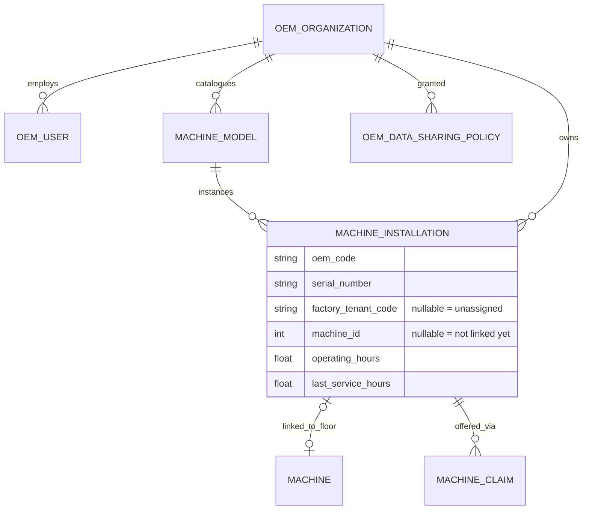
Key facts:
- **`OemUser` is a separate table** from `User` — a completely separate identity world.
- **`MachineInstallation` is the durable machine identity** (there is no separate "manufactured machine" entity). It carries **two** ownership columns: `oem_code` (who built it) and `factory_tenant_code` (who runs it — **nullable**; `NULL` = manufactured but unassigned).
- Warranty, service interval, and telemetry profile are **columns** on `MachineModel`/`MachineInstallation`, not separate entities.

### Why an OEM is NOT just another factory tenant (the keystone)
Every factory table is filtered by the request's bound `tenant_code`. An OEM request binds a **sentinel tenant that no factory can hold: `OEM:<code>`** (`oem_auth.sentinel_tenant`). Because no factory row has `tenant_code = "OEM:AERON"`, **every factory operational table returns zero rows for an OEM by construction** — before any route logic runs. Defence in depth on top:
- The sentinel branch in `effective_tenant` is **terminal** — an OEM can't fall through to the founder `X-Tenant` preview.
- The `:` namespace is **reserved** — no tenant code containing `:` can be created (#518 closed the hole where a literal `OEM:AERON` tenant had been creatable and visible).
- The JWT carries `principal:"oem"`; factory routes 403 an OEM token, OEM routes 403 a factory token.
- `oem_auth.resolve` **re-reads the principal from the DB on every request** — a suspended OEM user is locked out next request.
- `MachineInstallation`/`MachineClaim` are deliberately **outside** the auto-scoped set (the sentinel would hide the OEM's own fleet); their queries filter `oem_code` explicitly, and the counterparty column is named `factory_tenant_code` (not `tenant_code`) so it can't be caught by the generic hook.

### The OEM portal (frontend)
`frontend/app/oem/page.tsx` + `lib/oem.ts` + `components/OemMachineRegistry.tsx`. White-label branding from `/oem/me`. Crucially, the UI distinguishes **"not shared" vs "offline"** and never renders a privacy setting as an operational fact (no `?? 0`).

### If you want to change the OEM platform
Fleet fields → `oem_sharing.fleet_row` (Chapter 21). New OEM entity/relationship → `models.py` + migration; keep it filtered by `oem_code` and **out** of the tenant auto-scope. New OEM role/capability → `oem_auth.ROLE_CAPABILITIES`.

### Quick recap
An OEM is a **machine maker** with its own users (`OemUser`), catalogue (`MachineModel`), and fleet (`MachineInstallation`, dual-owned by `oem_code` + `factory_tenant_code`). It binds a **sentinel tenant `OEM:<code>`** so factory tables return nothing by construction — that, plus a reserved namespace, per-request DB re-checks, and token separation, is why OEM ≠ factory tenant.

---

# Chapter 20 — Machine Claim

### What you will understand
How a machine safely moves from "AERON built it" to "it's live in Factory A's AMP and reporting to AERON's fleet" — a flow designed around one principle: **the OEM proposes, the factory disposes** (ADR-0019).

### Why this is hard
The dangerous version would let an OEM *assign itself* to a customer ("SN001 belongs to Factory A") — an OEM could then claim visibility into any factory. AMP inverts it: the OEM can only **offer**; only the **factory** can **accept**. The factory is always the one that decides who sees its shop floor.

### The flow (verified — route · function · security)
```mermaid
sequenceDiagram
  participant O as OEM (AERON)
  participant F as Factory A Admin
  participant DB as DB
  O->>DB: POST /oem/machines  (register SN001, factory_tenant_code=NULL, status=Manufactured)
  O->>DB: POST /oem/machines/{id}/claim → one-time CODE (AMP-XXXXX-XXXXX-XXXXX)
  Note over O,F: code ships with the machine (QR = APP_URL/claim/<code>)
  F->>DB: GET /connected-equipment/claim/{code}  (PREVIEW — Admin only)
  F->>DB: POST /connected-equipment/claim/{code} (ACCEPT + choose consent)
  Note over DB: atomic: claim Pending→Claimed AND installation factory_tenant_code=A
  F->>DB: POST /connected-equipment/{id}/link  (link to a floor Machine)
  O->>DB: POST /oem/machines/{id}/commission → Active
  Note over O,DB: telemetry (MQTT) now updates operating_hours; appears in /oem/fleet
```

| Step | Route | Security |
|---|---|---|
| Register | `POST /oem/machines` | `require_oem("manage_installations")`; `oem_code` from the **principal**, not the body; serial unique per OEM |
| Offer | `POST /oem/machines/{id}/claim` | refuses if already installed or a live claim exists; **raw code returned once**, only its SHA-256 stored |
| Preview | `GET /connected-equipment/claim/{code}` | **`require_roles(["Admin"])`** — Admin-gated *even to read* (prevents a probing oracle) |
| Accept | `POST /connected-equipment/claim/{code}` | Admin; failed attempts audited in the attempting tenant |
| Link | `POST /connected-equipment/{id}/link` | Admin; both ends filtered to the tenant; one-machine-one-installation |
| Commission | `POST /oem/machines/{id}/commission` | `require_oem("commission")` |

### The security is in the SQL (the atomic accept)
Acceptance is **two conditional UPDATEs whose row-count is the decision** (`oem_claims.py`):
```sql
UPDATE machine_claims        SET status='Claimed'  WHERE id=? AND status='Pending';        -- 0 rows → refuse
UPDATE machine_installations SET factory_tenant_code=?, status='Assigned'
                             WHERE id=? AND factory_tenant_code IS NULL;                    -- 0 rows → rollback
```
This single pattern gives you, for free:
- **One-time use / double-claim / concurrency:** a second attempt matches 0 rows (already `Claimed`); the second UPDATE's `IS NULL` guard closes the "taken by another path" race; partial success rolls back.
- **Claim hashing:** the code is ~75 bits from an unambiguous alphabet (no I/L/O/U/0/1); only `sha256(code)` is stored; lookup is by hash (no scan, no timing side-channel); `code_hint` keeps the last 4 for support.
- **Expiry:** mandatory (default 30 days, cap 365), evaluated **at use** — a clock change can't resurrect a spent claim.
- **Replay/uniform refusal:** a spent, expired, wrong, or not-yours code all return the **one identical 404** on both preview and accept (a test asserts they're byte-identical), so an attacker learns nothing.
- **Why an OEM can't self-assign:** no route sets `factory_tenant_code` except the **factory-side accept**; the OEM's only writes touch its own installation columns. A `tenant` field in the accept body is **ignored** — the tenant comes from the accepting Admin's token (proven by test).

### Transfer (Factory A → Factory B)
There's no reassignment shortcut. Factory A **releases** the machine (`→ Sold`, `factory_tenant_code=NULL`, unlinked), the OEM issues a **fresh claim**, and Factory B accepts. History stays in the event/audit log under whichever tenant it happened.

### If you want to change the claim flow
Code format/expiry → `oem_claims.py`. Accept/link behaviour → `connected_equipment_routes.py`. The invariant to preserve: **only the factory-side accept may set `factory_tenant_code`.**

### Quick recap
The OEM **offers** a machine via a one-time, hashed, expiring claim code; only a factory **Admin** can preview and **accept**, and acceptance is an **atomic conditional UPDATE** that provides one-time-use, race safety, and a uniform refusal. The OEM can never assign itself — the tenant always comes from the accepting factory's token. That's ADR-0019: *the OEM proposes, the factory disposes.*

---

# Chapter 21 — OEM Consent

### What you will understand
How a factory controls *exactly* what its machine-maker can see — and the "allowlist" discipline that makes a new field **fail closed** (invisible) by default.

### The scenario
Factory A grants AERON:
```
Machine health    YES        Production      NO
Operating hours   YES        Inventory       NO
Service status    YES        Work orders     NO
Alarms            YES
```
AERON must see health/hours/service/alarms for its own machine — and nothing else, ever.

### Terms first
- **Grant** — one switch (`SHARE_OPERATING_HOURS`) the factory turns on. There are **7**: `SHARE_MACHINE_HEALTH, SHARE_OPERATING_HOURS, SHARE_SERVICE_STATUS, SHARE_ALARMS, SHARE_TELEMETRY, SHARE_MAINTENANCE_HISTORY, SHARE_DOWNTIME`.
- **Default-deny** — the absence of a policy row means *nothing* is shared. You opt in, never out.
- **Allowlist** — build the OEM's view by **copying a field in only if its grant is present**, rather than building the full view and **removing** forbidden fields. Allowlist fails *closed*; a "denylist" fails *open*.

### How AMP enforces it (verified `backend/oem_sharing.py`)
Grants are stored as a CSV on `OemDataSharingPolicy` (per `oem_code`+`tenant_code`), set by the factory via `PUT /connected-equipment/sharing` (Admin-only). The OEM-visible payload is built field-by-field as an **allowlist**:
```python
row["operating_hours"] = None                     # default: hidden
...
if SHARE_OPERATING_HOURS in grants:               # copy in ONLY if granted
    row["operating_hours"] = installation.operating_hours
```
`grants_for` is read **fresh on every request** — never cached — so a revocation takes effect on the *next* request.

**Trace: factory switches Operating Hours OFF**
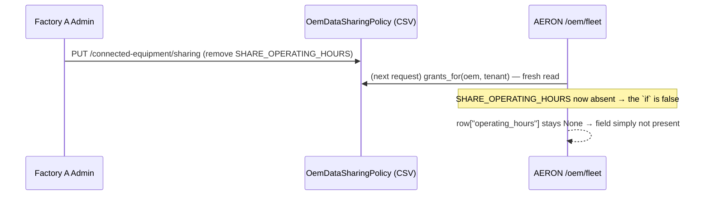
The `"shared"` block still lists what *is* granted, so the OEM can tell **"not shared" apart from "no data."**

### The leak this design killed (#522) — worth studying
The same withheld hour-meter leaked **two** ways, and the fix illustrates two security lessons:
1. **Prose leak.** The service queue printed the hours *inside a free-text reason string* ("4120.0 h run…") while the structured field was correctly hidden. Lesson: **a grant governs a FACT, not a field** — the number must not ride in an explanation either. Fixed by routing the service queue through the allowlist and rewriting the reason without the figure.
2. **Oracle leak (the subtle one).** The service verdict is `operating_hours − last_service_hours` vs the interval, and `last_service_hours` was **caller-supplied**. An OEM with only `SHARE_SERVICE_STATUS` could POST probe values and **binary-search the hidden meter** (measured: 24 requests recovered 6421.7). Fixed: a caller lacking `SHARE_OPERATING_HOURS` **may not supply** `service_hours` at all, and the refusal is value-independent (so it isn't itself an oracle). Lesson: **a comparator can leak the number it compares against.**

### If you want to change consent
Add a grant → add the `SHARE_*` key + an allowlist copy-in block in `oem_sharing.py` (never a redact-out). New shareable field → default it hidden, copy in under its grant. The rule: **copy-in, never filter-out.**

### Quick recap
Consent is 7 factory-controlled grants, **default-deny**, read fresh per request. The OEM view is built as an **allowlist** (copy a field in only if granted), so new fields are invisible by default. The hour-meter incident taught two rules now baked in: a grant governs a *fact* (prose counts), and a *comparator* can be an oracle.

---

# Chapter 22 — Commissioning, Warranty & Service

### What you will understand
The real lifecycle of an installed machine, and a clean engineering lesson: why `hours % interval` was the wrong way to compute "service due."

### The lifecycle (verified `backend/oem_service.py`)
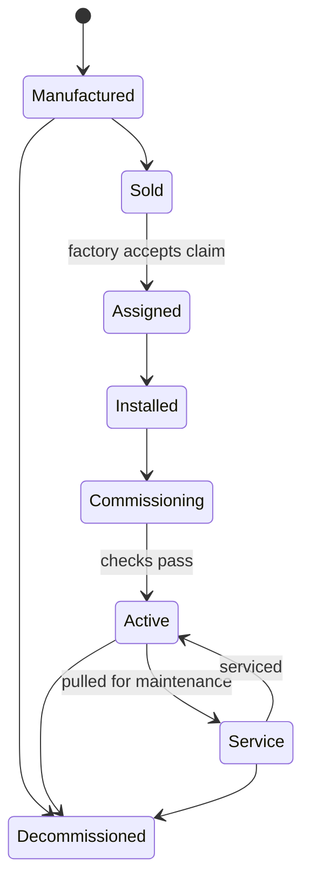
Transitions are enforced by `oem_service.transition` — an illegal jump raises `LifecycleError`. `Decommissioned` is reachable from any state (terminal); a **transfer** returns a machine to `Sold`/unassigned so it can be re-claimed by another factory (Chapter 20).

- **Commissioning** (`POST /oem/machines/{id}/commission`) runs a checklist (`assigned_to_customer`, `linked_to_machine`, `telemetry_profile`, `has_reported`) — advice, not a hard gate — and emits `MachineCommissioned`.
- **Warranty** is columns, not a state: `warranty_start`/`warranty_end` on the installation, `warranty_months` on the model. `warranty_state` **refuses to invent** a period — blank stays an honest "unknown," never an assumed 12 months (the #523 fix that also made the registration form actually offer the dates).
- **Operating hours** come from telemetry (`operating_hours`, monotonic-guarded).

### The service-due calculation, and the modulo bug
**Now (correct)** — `oem_service.service_state`:
```python
since     = operating_hours - (last_service_hours or 0.0)
remaining = service_interval_hours - since
# remaining <= 0 → "overdue" ; <= 5% → "due" ; <= 15% → "due_soon" ; else "ok"
```
Guards: no interval → `"not_configured"`; no hours → `"unknown"`; meter below last service (controller reset) → `"unknown"`, never a fake negative.

**Why `hours % interval` was wrong.** The modulo form assumes every service happened *exactly* on schedule — which makes **"overdue" unreachable.** A machine at **2,100 h** against a **2,000 h** interval that was *never serviced* would report *"1,900 h remaining"* (2100 % 2000 = 100 → 1900 left) instead of the truth: **"100 h overdue."** The fix was to record `last_service_hours` (the meter reading at the last actual service) and subtract it — which is exactly why `POST /oem/machines/{id}/service` exists: it writes the number the modulo assumption was standing in for. The module is deliberately named *"Service Intelligence, not predictive maintenance"* — it refuses to guess; `confidence` is attached only to trend projections, never to arithmetic.

### If you want to change service logic
Thresholds/states → `oem_service.py` (`service_state`, `LIFECYCLE`, `COMMISSIONING_CHECKS`). Warranty policy → `warranty_state`. Recording a service → `POST /oem/machines/{id}/service` (writes `last_service_hours`/`last_service_at`).

### Quick recap
An installation walks `Manufactured→…→Active⇄Service` under enforced transitions. Warranty and hours are honest columns that refuse to invent values. Service-due = `operating_hours − last_service_hours` vs interval — **not** `hours % interval`, which made "overdue" impossible. Recording a service writes the last-service meter that the correct formula needs.

---

# Chapter 23 — Frontend

### What you will understand
How the screens are built, how they talk to the backend, and where you go to add a page, a dashboard card, or a whole section.

### Terms first
- **React** — a library for building UI from **components** (reusable pieces that render HTML and hold state). **State** = data a component remembers (e.g. the machines it fetched).
- **Next.js** — a framework on top of React that adds **file-based routing** (a file's location *is* its URL) and build tooling. AMP is on **Next 16 / React 19 / Tailwind 4**. (`frontend/AGENTS.md` warns Next 16's APIs differ from older docs — treat deep framework specifics as **UNVERIFIED** unless the file shows them.)
- **`"use client"`** — a marker at the top of a component that says "this runs in the browser" (needed for anything interactive). All of AMP's current pages are client components.

### The structure (verified `frontend/`)
```
app/                pages = routes
  page.tsx            /            (marketing landing)
  login/page.tsx      /login       (tries /login then /oem/login)
  dashboard/page.tsx  /dashboard   (the factory MES — 2,934 lines)
  oem/page.tsx        /oem         (the manufacturer portal)
  claim/[code]/page   /claim/<code>(machine-claim QR landing)
components/           one *Section.tsx / *Snapshot.tsx per domain
lib/                  api.ts (HTTP client), live.ts (socket), modules.ts, types
```

**The one HTTP client — `lib/api.ts`.** `API_URL` points at the backend; `getAuthHeaders()` attaches `Authorization: Bearer <token>` (+ optional `X-Tenant` for founder preview); `apiGet/apiPost/...` wrap `fetch`. It also does **sliding-session refresh** (`POST /auth/refresh` when <60 min left) and redirects to `/login` only when the token is genuinely expired. The JWT lives in `localStorage`; role/tenant are decoded client-side **for display/routing only** — every real authorization decision is the server's.

**The live socket — `lib/live.ts`.** Opens `ws(s)://<API>/ws/live?token=<jwt>`, patches machine state in place, and treats refusal close-codes (4400/4401/4403) as permanent (don't retry a revoked session). A 3-second poll is the safety net.

**The dashboard.** `app/dashboard/page.tsx` polls `fetchAll()` every 3 s (`Promise.allSettled` over ~43 optional analytics endpoints, so one failed card can't blank the page). The sidebar is rendered from the **backend module manifest** (`GET /modules` ← `modules.json`), and each view passes a **role gate** (`canRoleSeeView`) then a **licence gate** (`isViewEnabledIn` → `LockedModuleView`).

### The reusable card pattern (`components/OeeSnapshot.tsx`)
Every dashboard card is a small self-contained component:
```tsx
export default function OeeSnapshot() {
  const [s, setS] = useState<OeeSummary | null>(null);
  const load = useCallback(async () => {
    try { setS(await apiGet<OeeSummary>("/oee-summary")); } catch {}
  }, []);
  useEffect(() => { load(); const id = setInterval(load, 30000); return () => clearInterval(id); }, [load]);
  if (!s || !s.plant.has_data) return null;   // render nothing until there's data
  return ( /* …tailwind card… */ );
}
```

### The founder's three questions
- **"I want a new Mission Control card."** Add a card to `components/MissionControlSection.tsx` (fetch its read-model via `apiGet`, 30 s interval), or write a new `*Snapshot.tsx` and drop it in.
- **"I want a new Machine Cockpit field."** Add it to `ai/twin.build_machine_detail` (backend) and render it in `components/MachineDetailDrawer.tsx`.
- **"I want a whole new page."** Create `app/<route>/page.tsx` (folder = URL; `[param]` for dynamic). For a new dashboard **section**: build the component, add a nav entry (ideally in `backend/modules.json`, no frontend release needed), wire `renderSection("key", <NewSection/>)`, and set its visibility in `lib/modules.ts`.

### Quick recap
Frontend = Next.js **app/** pages (file = route) + **components/** (`*Section`/`*Snapshot`, mirroring backend domains) + **lib/** (`api.ts` the one HTTP client, `live.ts` the socket). Cards are small fetch-on-interval components. Nav + gating come from the backend module manifest + role/licence checks. Add a card → a component; add a page → `app/<route>/page.tsx`.

---

# Chapter 24 — Testing

### What you will understand
How AMP stays correct while one person changes it fast — and the clever technique (mutation testing) that checks the tests themselves.

### The test types (all present, verified)
| Type | What it proves | Examples |
|---|---|---|
| **Unit** | pure logic is correct | `test_duration.py`, `test_oee*.py`, `test_analytics_engine.py` |
| **Integration / API** | endpoints behave end-to-end (via FastAPI TestClient) | `test_*_routes.py`, `test_api_smoke.py` |
| **PostgreSQL parity / schema** | it works on *real* Postgres, not just SQLite | `test_schema_guard.py`, `test_boot_migrations.py`, `verify_pg_deploy.py` |
| **Null-safety / edge** | NULL/empty/zero-denominator can't 500 | many `test_*_null_safe.py`, `test_create_paths_409.py` |
| **Adversarial / security** | isolation & consent can't be bypassed | `audit_isolation.py`, `audit_oem_adversarial.py`, `audit_three_customers.py` |
| **Mutation** | *the tests actually test* | 12 `mutate_*.py` + `frontend/mutate-oem-ui.mjs` |
| **Performance / load** | it holds up under scale | `loadtest.py`, `load/` harness |
| **Frontend** | UI logic + user journeys | Vitest over `lib/` (92.6% branch) + Playwright `e2e/` |

**The contract:** every `backend/test_*.py` is a **standalone script** (`python test_X.py`, exit 0 = pass); pytest was layered on top for coverage. Counts: **193 `test_*.py`, 8 `audit_*.py`, 12 `mutate_*.py`.** Coverage floors are **ratchets that never drop** (backend 78%, frontend 89%), and they use **branch** coverage deliberately — the NULL/zero arcs are the ones that crash in front of a customer.

### Mutation testing, explained simply (the clever bit)
A passing test suite can be **worthless** if it doesn't actually check the thing that matters. Mutation testing proves it does: **deliberately break the source, and confirm a test goes red.** If the suite stays green after you broke the rule, the suite has a hole.

**Real example (`mutate_oee_contract.py`):**
- **Rule** (in `oee_contract.py`): quality = good ÷ total.
- **Mutation applied:** change it to `total / total` — i.e. **count rejected parts as good** (quality always 100%).
- **Expected:** `test_oee_contract.py` turns **red** → harness prints `caught`. If it stayed green it would print **`SURVIVED`** — a real gap to fix.

**Security example (`mutate_oem_sharing.py`):** remove the `oem_code` filter, or disable the bisection guard — the OEM isolation suites must catch each. Two documented "survivors" are defence-in-depth layers behind the sentinel (belt *and* braces). The source is restored after each mutation.

### If you want to change testing
Add a feature → add a `backend/test_<feature>.py` (standalone script style) and, for a security rule, a `mutate_<feature>.py` that breaks the rule and asserts red. Frontend logic → a Vitest in `frontend/`; a user journey → a Playwright spec in `frontend/e2e/`.

### Quick recap
AMP has unit, API, Postgres-parity, null-safety, adversarial, **mutation**, and load tests — 193 backend scripts, each runnable alone, with never-dropping coverage floors. Mutation tests break the source on purpose to prove the tests actually protect the rule (a `SURVIVED` line = an untested guarantee). This is what lets a solo founder refactor without fear.

---

# Chapter 25 — Git, PR, CI/CD

### What you will understand
How a change goes from your editor to production safely — and what the automated checks actually verify.

### Terms first
- **Git** — version control; it records every change as a **commit** (a snapshot + message).
- **Branch** — a parallel line of work; you branch off `master`, make commits, then merge back.
- **PR (Pull Request)** — a proposal to merge a branch, where checks run and the change is reviewed.
- **CI (Continuous Integration)** — automated checks that run on every push (**GitHub Actions** here).
- **CD (Continuous Deployment)** — merging to `master` automatically deploys.

### AMP's pipeline
```mermaid
flowchart LR
  L["local edit"] --> BR["git branch + commit"]
  BR --> PU["git push → GitHub"]
  PU --> CI["GitHub Actions ci.yml (5 jobs)"]
  CI -->|green| MG["merge to master"]
  MG --> RW["Railway auto-deploys backend"]
  MG --> VC["Vercel auto-deploys frontend"]
  RW --> MIG["preDeploy: migrate.py → /readiness gate"]
  MIG --> PROD["app.marx8.com live"]
```

### The 5 CI jobs (`.github/workflows/ci.yml`, verified)
1. **backend** — compile-check; run **every** `test_*.py` (all run even if one fails, so a red build lists them all); a boot check (`import main`, count routes); and the **AERON end-to-end OEM+factory+MQTT demo journey** as its own step.
2. **migrations (real Postgres 18 service)** — the **#513 gate**: build from the frozen baseline schema → `alembic upgrade head` → **assert the autogenerate diff is empty** (a model changed without a migration = fail) → prove the detector can fail (inject a probe column) → run `verify_pg_deploy.py` (a 6-case migration matrix) → schema/boot/migrate tests on Postgres.
3. **coverage** — `pytest --cov --cov-fail-under=78` (its own job so a coverage dip isn't mistaken for a test failure).
4. **frontend** — `npm ci`, Vitest with the 89% floor, `next build`, and a **load-harness drift check** (fails if the load test's endpoint list drifts from the dashboard's `fetchAll`).
5. **e2e** — Playwright (chromium) against a mocked API; uploads a trace on failure.

Two more workflows: **`backup.yml`** (daily `pg_dump` + a restore drill) and **`retention.yml`** (weekly data-retention, dry-run on schedule, apply only on manual dispatch). Chapter 26.

### Quick recap
Local → branch → push → **GitHub Actions (5 jobs: backend tests, Postgres migration gate, coverage, frontend, e2e)** → merge → **Railway (backend) + Vercel (frontend)** auto-deploy, with `migrate.py` + `/readiness` gating the cutover. The migration job is the direct descendant of the `is_active` outage.

---

# Chapter 26 — Production / Railway

### What you will understand
Exactly how your code becomes `app.marx8.com`, and the env vars and safety nets that keep it up.

### The path to production
- **Frontend** builds on **Vercel** (`frontend/vercel.json`, `npm run build`) and serves **`app.marx8.com`**.
- **Backend** builds on **Railway** with **NIXPACKS** (`backend/railway.toml`). Start command is byte-identical across `Procfile`, Dockerfile, and railway.toml: `python -m uvicorn main:app --host 0.0.0.0 --port $PORT`.
- **The deploy invariant (ADR-0018):** `DEPLOY → MIGRATE → START → READINESS → TRAFFIC`. `preDeployCommand = "python migrate.py"` runs *in the new image before it serves*; a non-zero exit **aborts the deploy and the previous version keeps serving** — a failed migration costs a release, not an outage. `healthcheckPath = "/readiness"` gates traffic.

### Key environment variables (verified)
| Var | Purpose |
|---|---|
| `DATABASE_URL` | PostgreSQL connection (no fallback — must fail loud; CI uses SQLite) |
| `SECRET_KEY` | JWT signing (prod refuses to boot without it) |
| `ALLOWED_ORIGINS` | CORS allow-list |
| `RAILWAY_ENVIRONMENT` / `PRODUCTION` | the "this is prod" gate (a prod DB with no `alembic_version` is refused) |
| `GIT_COMMIT_SHA` / `RAILWAY_GIT_COMMIT_SHA` | build version shown on `/health` |
| `NEXT_PUBLIC_API_URL` | frontend → backend address |
| `ANTHROPIC_API_KEY` / `GEMINI_API_KEY` | enable the LLM copilot (optional) |
| `MQTT_BROKER` / `MQTT_PORT` / `MQTT_TOPIC_PREFIX` | machine ingest |
| `GMATS_ADMIN_USERNAME` / `_PASSWORD`, `RESEED_FACTORY`, `TRIAL_DAYS`, `SENTRY_DSN` | seeding, trials, error monitoring |

### Health, backup, restore, retention
- **`/health`** = liveness (`SELECT 1` + schema verdict; 200/503; reports the git SHA). **`/readiness`** = correctness (200 only when the schema is at the required revision). The distinction is the `is_active` lesson (Chapter 6).
- **Backup** (`backup.yml`, daily 02:17 UTC): `pg_dump` → gzip → 30-day artifact, with assertions that it's a *real* dump (min size, ≥40 `CREATE TABLE`), then a **restore-drill job** restores it into a throwaway Postgres — *"a backup you've never restored is not a backup."*
- **`restore_drill.py`** measures **RTO** (dump → new DB → restore → migrate → boot → real login → verify data + 3-tenant isolation). RPO = 24h (the backup cadence).
- **Retention** (`retention.yml`, weekly): dry-run on schedule, apply only on a manual dispatch with `apply=true`.
- **Single worker on purpose:** the backend owns in-memory state (the 45 s sim loop, the MQTT subscriber thread, rate-limit counters, licence cache) — **do not** add `--workers`/`WEB_CONCURRENCY`.

### Quick recap
Merge → Vercel builds the frontend (`app.marx8.com`), Railway builds the backend (NIXPACKS), migrations run **before** serving, and `/readiness` gates traffic. `SECRET_KEY`/`DATABASE_URL` are mandatory; backups are taken daily *and restore-tested*; the backend runs as a single worker because it holds live state.

---

# Chapter 27 — What Runs Where?

### What you will understand
A physical mental model — where each piece of AMP actually executes, and what happens if it goes down.

```mermaid
flowchart TD
  PC["Your Windows PC<br/>edit code, run tests, git push"] -->|push| GH["GitHub<br/>source of truth (master)"]
  GH --> GA["GitHub Actions<br/>CI: tests, migration gate, e2e"]
  GH -->|deploy| RW["Railway<br/>FastAPI backend (1 worker)<br/>+ MQTT thread + sim loop"]
  GH -->|deploy| VER["Vercel<br/>Next.js frontend (app.marx8.com)"]
  RW --> PG[("Railway PostgreSQL<br/>the permanent memory")]
  BR["Browser (user)"] --> VER
  BR -->|HTTPS + WS| RW
  MB["MQTT broker"] --> RW
  PLC["Factory PLC / simulator"] -->|MQTT| MB
```

| Place | What lives/executes there | If it goes offline |
|---|---|---|
| **Your PC** | editing, running tests, `git push` | nothing in prod is affected |
| **GitHub** | the canonical source (`master`) + Actions | can't deploy/merge; running prod unaffected |
| **GitHub Actions** | CI checks + backup/retention crons | no new deploys; backups pause |
| **Railway** | the FastAPI backend, MQTT ingest thread, 45 s sim loop | **the API is down** → frontend shows errors, live feed stops (dashboard keeps last state) |
| **PostgreSQL (Railway)** | all persistent data | backend can't read/write → `/health` 503; **this is the one to protect** (hence daily restore-tested backups) |
| **Vercel** | the frontend bundle | users can't load the UI; the API/DB are fine |
| **Browser** | the running UI + the JWT (localStorage) + the WebSocket | that user is offline; others unaffected |
| **MQTT broker** | routes machine telemetry to the backend | no live machine updates; everything else works (HTTP ingest still available) |
| **Factory PLC / simulator** | produces the telemetry (today: simulator) | that machine's live data goes stale; historical data intact |

### Quick recap
Code lives on **GitHub**, is checked by **Actions**, and deploys to **Railway** (backend + MQTT + sim) and **Vercel** (frontend). All durable truth is in **Railway PostgreSQL** — the single most important thing to back up. Browsers hold only a token and a socket. The database is the crown jewel; everything else is replaceable.

---

# Chapter 28 — How Do I Change AMP?

### What you will understand
The two most common kinds of change, worked end to end, so you can map *any* feature request onto AMP's layers.

### The universal checklist (AMP-native order)
For anything non-trivial: **data → migration → domain logic → events → API → permissions → tenancy → read model → UI → tests → CI → deploy.**

### Example 1 — add "machine vibration"
**Question:** does vibration need telemetry, DB, event, read-model, API, UI, agent, tests? **Decide by asking "does anything need to *react* to it?"** Minimal version (display only):
1. **Telemetry** — add `vibration` to the MQTT payload; handle it in `mqtt_service.on_message` (write to `IoTTelemetry`, or add a `Machine.vibration` column).
2. **Data + migration** — if a column: `models.py` `Machine.vibration` + an Alembic migration (`alembic revision`).
3. **Read model** — surface it in `ai/twin.build_machine_detail` (so it shows on the cockpit).
4. **API** — it flows out via the existing `/machine-health/{id}` (no new endpoint needed).
5. **UI** — render it in `components/MachineDetailDrawer.tsx`.
6. **Tests** — extend `test_twin.py` / a null-safety test.
   *No event or agent needed* — unless you want "alert when vibration is high," in which case add a threshold in `predictive_engine.py` (feeds the risk score) or publish a new event + subscriber.

### Example 2 — add an "Energy Management" module (the full AMP-native path)
```mermaid
flowchart TD
  R["1 · modules.json: register 'energy' pack (licensing/nav)"] --> D["2 · models.py: EnergyReading + tenant_code + migration"]
  D --> S["3 · energy logic (a service fn or ai/energy.py read-model)"]
  S --> E["4 · react to events: subscribe to ProductionCompleted in ai/subscribers or a new register()"]
  E --> A["5 · energy_routes.py: APIRouter(prefix='/energy') + endpoints"]
  A --> P["6 · require_roles([...]) on writes"]
  P --> T["7 · tenant: add EnergyReading to SCOPED_MODELS + CORE_TENANT_TABLES"]
  T --> M["8 · main.py: include_router(energy_routes.router)"]
  M --> RM["9 · ai/energy read-model + GET in read_model_routes.py"]
  RM --> U["10 · components/EnergySection.tsx + renderSection + lib/modules.ts gating"]
  U --> TS["11 · test_energy_routes.py + mutate_energy.py + isolation test"]
  TS --> CI["12 · push → CI green → merge → Railway/Vercel deploy"]
```
Each step maps to a chapter: data/migration (6), events (11), API (7), permissions/tenancy (17–18), read model (12), UI (23), tests (24), deploy (25–26). Notice you **never edit another domain's code** — you add a router, a subscriber, and a component, and register them. That composability is the entire point of the architecture.

### Quick recap
Map every change onto: data → migration → logic → events → API → permissions → tenancy → read-model → UI → tests → deploy. A display-only field skips events/agents; a full module is ~12 additive steps that touch *new* files plus three registration points (`main.py include_router`, an event `subscribe`, `modules.json` + `renderSection`). Adding, not editing, is the norm.

---

# Chapter 29 — Module Code Map

### What you will understand
A single lookup: for any module, where its frontend, routes, logic, tables, events, read-model, agent, and tests live. *(The exhaustive grid is its own file: **AMP-MODULE-MAP.md**.)*

| Module | Frontend | Routes | Logic/engine | Tables | Events | Read-model | Agent | Tests |
|---|---|---|---|---|---|---|---|---|
| Machines | MachineHealthSection | machines_routes | machine_status | Machine, DowntimeLog, MachineEvent | DowntimeStarted | ai/twin, ai/downtime | Maintenance, Escalation | test_machine_* |
| Work Orders | WorkOrdersSection | work_orders_routes | subscribers, bom | WorkOrder | ProductionCompleted | ai/production | Yield | test_work_orders_routes |
| Inventory | InventorySection | inventory_routes | subscribers | InventoryItem, InventoryTransaction | InventoryLow | ai/inventory, ai/coverage | Reorder | test_* |
| Quality | QualitySection | quality_routes | — | QualityInspection | QualityInspectionFailed | ai/quality | Quality | test_quality_* |
| OEE/Analytics | ExecutiveOeeSection | analytics_routes | analytics_engine, oee_contract | ProductionRecord | — | ai/oee, ai/losses, ai/recovery | — | test_oee*, test_oee_contract |
| Maintenance | MaintenanceSection | factory_ops_routes | — | MaintenanceTask | — | ai/maintenance | Maintenance | test_maintenance* |
| Agents/Mission Control | MissionControlSection, ApprovalsInbox | agent_routes | ai/agents, approvals | AgentAction, AgentPolicy | (consumes all) | ai/insights, ai/impact, ai/pulse | (all) | test_agents, test_agent_routes |
| OEM | OemMachineRegistry | oem_routes, connected_equipment_routes | oem_service, oem_sharing, oem_claims | MachineInstallation, MachineClaim, OemDataSharingPolicy | OEM events | oem_sharing.fleet_row | — | test_machine_claim, test_oem_service_consent |
| Users/RBAC | UsersSection | users_routes | auth, security | User | — | — | — | test_users_routes |
| SaaS/Platform | SaaSAdminSection | saas_routes, platform_routes | onboard/offboard_tenant | CompanyTenant, TenantConfig | — | — | — | test_onboarding, test_offboarding |

### Quick recap
Every module follows frontend `*Section` ↔ `*_routes.py` ↔ tables ↔ (event) ↔ `ai/*` read-model ↔ tests. Use this table (or the full **AMP-MODULE-MAP.md**) to jump straight to the file you need.

---

# Chapter 30 — Data-Flow Cheat Sheets

### What you will understand
The key end-to-end flows in one glance each. *(The complete set is its own file: **AMP-DATA-FLOWS.md**.)*

- **LOGIN:** browser `POST /login` → `core_routes.login` → bcrypt verify → JWT(sub,role,tenant) → localStorage → `Bearer` on every call. (Ch.5)
- **MQTT:** machine → `flowmes/{tenant}/{site}/machines` → `mqtt_service.on_message` → identity (tenant,site,name) → DB (Machine/MachineEvent/ProductionRecord/DowntimeLog) → broadcast → owning-tenant browsers. (Ch.15)
- **WORK ORDER → BOM:** `PATCH /work-orders/{id}=Completed` → publish `ProductionCompleted` → `move_bom_on_production_completed` consumes components + receives finished (atomic) → maybe `InventoryLow`. (Ch.10)
- **INVENTORY LOW → REORDER:** issue below reorder → `InventoryLow` → Reorder agent drafts PO (Draft) + AgentAction(Proposed) → auto-approved but stays Draft. (Ch.9/13)
- **AGENT APPROVAL:** event → agent proposes (pending) + AgentAction(Proposed) → human `POST /agent-actions/{id}/approve` → `approvals.authorise` (tenant/status/expiry/actor re-checked vs DB) → `apply_decision` executes. (Ch.13)
- **WEBSOCKET:** open `/ws/live?token=` → `ws_auth.resolve` before accept → `(socket,tenant)` → broadcast filtered by `tenant_code`. (Ch.16)
- **OEM CLAIM:** OEM `POST /oem/machines` (Manufactured) → `/claim` (one-time hashed code) → factory Admin previews → accepts (atomic conditional UPDATE sets `factory_tenant_code`) → link → commission → Active → fleet. (Ch.20)
- **OEM CONSENT:** factory `PUT /connected-equipment/sharing` (grants CSV) → OEM `/oem/fleet` → `oem_sharing.fleet_row` copies a field in **only if granted** (fresh read). (Ch.21)
- **OEM SERVICE:** `operating_hours − last_service_hours` vs interval → overdue/due/due_soon/ok (never `hours % interval`). (Ch.22)
- **DEPLOY:** push → CI (5 jobs) → merge → migrate.py → /readiness gate → Railway+Vercel live. (Ch.25–26)
- **BACKUP/RESTORE:** daily pg_dump → assert real → restore-drill into throwaway DB → measured RTO. (Ch.26)

---

# Chapter 31 — Current Reality (what AMP really does today)

### What you will understand
An honest capability map — essential for technical diligence and OEM conversations. **This is not an audit; it's a truthful status.**

| Capability | Status | Note |
|---|---|---|
| MES core (machines, WO, downtime, OEE, quality, inventory, BOM, maintenance, scheduling) | ✅ **BUILT + WORKING** | real endpoints, real DB, tenant-scoped |
| Multi-tenancy (HTTP + WS + MQTT isolation) | ✅ **BUILT + WORKING** | ADR-0002/0011/0016, adversarially tested |
| Event bus + subscribers | ✅ **BUILT + WORKING** | synchronous in-process; broker-ready design |
| Read-models / dashboards / Mission Control | ✅ **BUILT + WORKING** | ~45 projections |
| 5 AI agents + human approval gate | ✅ **BUILT + WORKING** | rule-based; oversight enforced (ADR-0015) |
| OEM platform (claim, consent, fleet, service) | ✅ **BUILT + WORKING** | newest; adversarially tested (ADR-0017/0019) |
| SaaS lifecycle (onboard, plans, trials, offboard) | ✅ **BUILT + WORKING** | ADR-0008 |
| CI/CD, migrations-before-serve, backup+restore drill | ✅ **BUILT + WORKING** | ADR-0018 |
| MQTT + HTTP telemetry ingest, live WebSocket | ✅ **BUILT + WORKING** | paho-mqtt + native WS |
| Machine data source (the telemetry itself) | 🟡 **SIMULATED** | random-value publisher scripts; the *pipeline* is real |
| Direct PLC protocols (OPC-UA, Modbus, S7, EtherNet/IP, ADS, FINS) | 🟡 **SIMULATED / REQUIRES OEM** | clean adapter framework; **no real driver installed**; needs per-OEM edge agent |
| LLM copilot | 🟡 **BUILT, OFF BY DEFAULT** | works only with an API key; rule-based assistant is the default |
| Predictive maintenance | 🟡 **RULE-BASED** (not ML) | deterministic risk score; **no trained ML models exist** |
| PROFINET / EtherCAT / CANopen | ❌ **NOT IMPLEMENTED** | test inputs only |

### The one-paragraph honest pitch
*"AMP is a working, multi-tenant, event-driven manufacturing platform: real MES, real tenant isolation, real live telemetry ingest (MQTT/HTTP + WebSocket), real AI agents under human approval, and a real OEM fleet/consent platform — all CI-tested and deployed with migrations-gated releases. The intelligence is deterministic rules today (with an optional LLM copilot and no trained ML yet), and direct PLC-protocol connectivity is simulated behind a ready adapter interface, pending per-OEM edge agents. Everything a customer clicks is real; the machine-side drivers and ML are the honest next frontier."*

### Quick recap
The platform, MES, isolation, events, agents, OEM, SaaS, and CI/CD are **real and working**. The **data source** (simulator), **direct PLC protocols** (adapter framework, no drivers), **LLM** (optional), and **ML** (none yet) are the clearly-labelled edges. Never claim ML or live PLC connectivity you don't have.

---

# If You Only Remember 20 Things About AMP

1. **AMP is an AI operating system for manufacturing**; the MES is its first app, not the whole product.
2. The root problem it kills: **the gap between what's happening on the floor and what humans know** — captured, remembered, shown live, acted on.
3. **Backend = FastAPI** (Railway), **frontend = Next.js** (Vercel, `app.marx8.com`), **truth = PostgreSQL**. `main.py` only *assembles* (ADR-0009).
4. Every request wears a **tenant badge**; two ORM hooks auto-filter reads and stamp writes, so **Factory A can't see Factory B** (Chapter 17).
5. **`tenant_code` is on almost every row** — the most important column in the schema.
6. **Login is stateless**: bcrypt verify → signed **JWT** (sub/role/tenant) → sent as `Bearer` on every call.
7. **Roles:** Admin > Supervisor > Operator (factory); OEM users are a *separate identity world*, capability-gated.
8. **The event bus is a noticeboard**: producers `publish` past-tense facts; subscribers react; adding a reaction never edits the producer.
9. **Four core events:** ProductionCompleted, DowntimeStarted, InventoryLow, QualityInspectionFailed.
10. **Work-order completion moves inventory via a subscriber + the tenant's DB BOM** — the flagship decoupling (ADR-0001/0013).
11. **Read-models** are pure `build_*` projections in `ai/` — recomputed per request, so they can't go stale (ADR-0007).
12. **AI honesty:** ~95% deterministic rules, **one optional LLM** feature, **zero trained ML models**.
13. **5 agents propose, humans approve.** The `approvals.py` gate re-checks the actor against the DB, not the token (ADR-0015). Only Reorder auto-approves — into a *Draft*.
14. **Digital Twin = live health read-model** (`health = 100 − rule-based risk`), not a physics simulation.
15. **MQTT/HTTP telemetry + WebSocket are real; direct PLC protocols are simulators** behind a ready adapter interface.
16. **Machine identity is (tenant, site, name)** — tenant comes from the MQTT *topic*, never the payload (ADR-0011).
17. **The WebSocket authenticates before it accepts** and broadcasts only to the owning tenant (ADR-0016).
18. **OEM ≠ tenant:** an OEM binds a sentinel `OEM:<code>` so factory tables return nothing by construction; the **factory** (not the OEM) accepts a **claim** (ADR-0017/0019).
19. **Migrations run before the app serves**; `/readiness` (schema-correct) is distinct from `/health` (alive). The `is_active` outage taught this (ADR-0018).
20. **To change AMP you mostly *add*, not edit:** a `*_routes.py`, a subscriber, a read-model, a `*Section.tsx`, and three registration points.

---

# AMP in 5 Minutes (how to explain it verbally)

> "AMP is an **operating system for factories**. Small and mid-size manufacturers run their shop floor on paper and spreadsheets, so they find out about problems too late to fix them. AMP is the live nervous system that fixes that: it **captures** machine data automatically over MQTT, **remembers** everything in a Postgres database, **shows it live** to the right people over a WebSocket, and **acts on it** with AI agents that watch for trouble and propose fixes a human approves.
>
> It's **multi-tenant SaaS** — many factories on one platform, each cryptographically walled off from the others. On top of the core MES (machines, work orders, inventory, quality, OEE) sits an **event bus** so new capabilities plug in without touching old code, a layer of **AI read-models and agents**, and — newest — an **OEM platform** that lets machine-makers watch their equipment across customer factories, but only with each factory's explicit consent.
>
> The intelligence today is mostly **smart rules plus an optional LLM copilot** — no trained ML yet, and direct PLC connectivity is simulated behind a ready adapter, so I'm honest about where the real edges are. Everything a user clicks is real, tenant-isolated, tested, and deployed through a migration-gated pipeline."

---

# AMP in 30 Minutes (for another engineer)

Cover, in order: **(1)** the three-layer sandwich (ERP/MES/PLC) and where AMP sits; **(2)** the request lifecycle — Next.js → JWT → FastAPI → middleware stack (tenant bind, schema guard, rate-limit, CORS, security headers, plan gate) → route → ORM (auto tenant-filter) → Pydantic → JSON; **(3)** the data model — 57 tables, `tenant_code`, `SCOPED_MODELS` + the two SQLAlchemy hooks; **(4)** the event bus — synchronous, in-process, shared session, append to `EventLog`, broker-ready; walk `ProductionCompleted → BOM subscriber`; **(5)** read-models — pure `build_*` projections, `pulse` over `twin`+`impact`; **(6)** AI honesty — rules vs one LLM vs no ML — and the 5 agents + `approvals.py` gate; **(7)** real-time — MQTT identity `(tenant,site,name)` and the auth-before-accept WebSocket; **(8)** the OEM platform — sentinel tenant, factory-controlled claim (atomic conditional UPDATE), allowlist consent; **(9)** ops — Alembic + `schema_guard` + `/readiness`, the `is_active` postmortem, CI's 5 jobs, backup-with-restore-drill; **(10)** the change model — additive: router + subscriber + read-model + component + 3 registrations. Anchor each on its ADR (there are 19).

---

# Test Your Understanding (25 questions — answers not provided; study, then self-check)

**Beginner (5)**
1. What problem does AMP exist to solve, in one sentence?
2. Which program is the "kitchen" and which is the "dining room," and what runs each?
3. What is a JWT, and why does it let the server be *stateless*?
4. What does `tenant_code` do, and why is it on almost every table?
5. Name the three factory roles and one thing only an Admin can do.

**Intermediate (10)**
6. Trace a login from click to database, naming the two files that verify the password and mint the token.
7. Why is a read-model *not* a cache, and what's the cost of that choice?
8. When a work order completes, how does inventory move without the work-order code importing inventory?
9. What are the four core domain events, and who produces each?
10. Why did AMP move machine identity from `name` to `(tenant, site, name)`?
11. How does the WebSocket keep Factory A's telemetry off Factory B's screen — name the two enforcement points?
12. What's the difference between `/health` and `/readiness`, and which incident created that split?
13. Which single agent auto-approves by default, and what safety keeps it harmless?
14. What does the `approvals.py` gate re-check, and why against the DB instead of the JWT?
15. Classify AMP's "AI" into its three honest buckets with an example of each.

**Advanced (10)**
16. Explain why the first tenant-scoping middleware deadlocked every POST, and what replaced it.
17. Why does an OEM bind a *sentinel* tenant instead of `None`, and what would break if it bound `None`?
18. Walk the atomic machine-claim accept — the two conditional UPDATEs — and name three attacks their row-counts defeat.
19. Describe both hour-meter leaks fixed in #522 and the two security principles they taught.
20. Why is `hours % interval` the wrong service-due formula, and what column fixed it?
21. Why did the `is_active` column outage pass every test yet break production — and what four layers now prevent that class?
22. How does the allowlist ("copy-in, never redact-out") make a *new* OEM-visible field fail closed?
23. Which tenant-owned tables are *not* in `SCOPED_MODELS`, and what secures them instead?
24. How does the event bus's synchronous shared-session design make a subscriber's write atomic with its producer — and what's the cost?
25. Given "add real Modbus support," list every file/seam you'd touch and where the real driver plugs in.

---

# Where Do I Change This? (quick index — actual paths)

| I want to… | Go to |
|---|---|
| Add a machine field | `backend/models.py` (Machine) + Alembic migration → `schemas.py` → `components/MachineHealthSection.tsx` |
| Add a telemetry signal | `backend/mqtt_service.py` (`on_message`) + `machine_status.py` if it maps to status/util |
| Change OEE math | `backend/oee_contract.py` (canonical) / `backend/analytics_engine.py` (pooled + per-record) |
| Change inventory reorder logic | `backend/inventory_routes.py` (trigger) + `backend/ai/agents.py` (draft qty) |
| Change the BOM / recipe | data: `PATCH /bom/{id}` (Admin); resolver: `backend/bom.py` |
| Add a domain event | `backend/events.py` (dataclass) + publish in the producing `*_routes.py` |
| Add a subscriber | a handler + `event_bus.subscribe(...)` in `backend/subscribers.py` or `backend/ai/subscribers.py` |
| Modify an agent / threshold | `backend/ai/agents.py` (constants at top) |
| Add a dashboard card | new `components/*Snapshot.tsx` + mount in `app/dashboard/page.tsx` (or a `*Section`) |
| Add an API endpoint | a `@router.verb` in the domain's `*_routes.py` (+ `require_roles` if it writes) |
| Add a database table | `backend/models.py` + Alembic migration; add to `SCOPED_MODELS`+`CORE_TENANT_TABLES` if tenant-owned |
| Add a permission/role gate | `require_roles([...])` on the endpoint; roles in `users_routes.py` + `frontend/lib/modules.ts` |
| Add an OEM field | `backend/oem_sharing.py` (allowlist copy-in) + a `SHARE_*` grant if it's consent-gated |
| Change OEM consent | `backend/oem_sharing.py` (grants + `fleet_row`/`service_view`) |
| Add a service rule | `backend/oem_service.py` (`service_state`, `LIFECYCLE`) |
| Add an industrial protocol (real) | `backend/industrial_adapters.py` — implement `read()` on a new adapter + register in `get_adapter()` |
| Add an entire module | new `*_routes.py` + models + migration + `main.py include_router` + `modules.json` + `components/*Section.tsx` + tests (Chapter 28) |

---

# Appendix — Observations (NOT ACTIONED)

*Noted while learning the code, per the teaching brief. These are **not** fixed here and are **not** a to-do list — just an honest margin of things a future you may want to look at.*

1. **`AgentAction` / `EventLog` carry `tenant_code` but are outside `SCOPED_MODELS`.** They rely on explicit route-level filtering (`agent_routes`/`approvals.py`) rather than the automatic ORM hook. Almost certainly fine (the gate re-checks tenant), but the money/material approval queue depending on manual filtering is worth a deliberate confirming look.
2. **Middleware-order comment vs add-order.** Inline comments near `main.py:701-711` describe `SecurityHeaders` as the outermost layer, which reads as inconsistent with `RequestContext`/`TenantScope` being added afterward. Behaviourally unverified (would need a running probe); a comment/code clarity nit at most.
3. **`is_active` not enforced on ordinary REST routes.** A disabled factory user's existing JWT still passes normal endpoints until it expires (≤4h). Enforced at the WebSocket and approval gate, not on plain REST. Documented behaviour (Chapter 18); flagged in case you want tighter revocation.
4. **No access-token revocation / refresh rotation.** Revocation relies on DB re-checks at refresh/approval/WS, not a denylist.
5. **GMATS Inventory is a tenant-specialized module** (`gmats_inventory_routes.py`, hard-coded `"GMATS"` + `seed_gmats`), which runs against the "build generic, not GMATS" directive.
6. **Doc drift:** `docs/Production-Setup.md` still names `flow-mes.vercel.app` and "CI: none yet" (CI now has 5 jobs); it and `docs/DOCKER.md` say **Postgres 16** while CI/backup images and prod are **Postgres 18**.
7. **`frontend/app/layout.tsx` metadata still says "Create Next App"** (cosmetic, likely unintentional).
8. **Rate limiting is per-instance** (in-process) — correct for single-worker, but a multi-instance deployment would want shared (Redis) limiting.
9. **ADR-0017 wording vs code:** the ADR says `MachineInstallation` "is registered in `MANUALLY_SCOPED`"; in code it's the column *name* (`factory_tenant_code`, not `tenant_code`) that keeps it out of the auto-scope check. Same effect, different mechanism than the prose implies.

*End of the AMP Founder Technical Handbook. Companion documents: AMP-ARCHITECTURE-CHEATSHEET.md · AMP-MODULE-MAP.md · AMP-DATA-FLOWS.md · AMP-CODE-CHANGE-GUIDE.md · AMP-VIDEO-COURSE-SCRIPT.md.*


